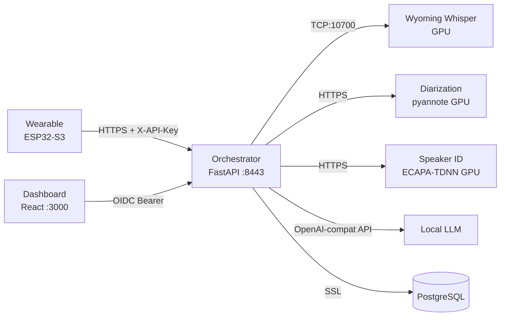

# Repository Guidelines

## Project Overview

LifeLog is a voice-activated life journal. A wearable recorder (XIAO ESP32-S3 + INMP441 mic) captures audio, compresses it with Opus, and uploads via HTTPS. A FastAPI orchestrator runs a pipeline: transcribe (Whisper via Wyoming protocol), diarize (pyannote.audio), identify speakers (ECAPA-TDNN), summarize (local LLM via OpenAI-compatible API), and store results in PostgreSQL. A React dashboard provides calendar browsing, recording playback with speaker segments, TODO/decision views, and speaker labeling with retroactive re-identification.

## Architecture & Data Flow



**Key architectural decisions:**
- **Parallel pipeline**: Transcription and diarization run concurrently; speaker identification waits for diarization
- **Stateless GPU services**: Voiceprints are passed in HTTP request bodies, not fetched from DB
- **Per-user encryption**: Audio encrypted with Fernet keys derived via PBKDF2 from user-specific secrets
- **Independent auth**: Device uploads use `X-API-Key`; dashboard uses OIDC JWT. Both map to the same user row
- **DB isolation**: Only the orchestrator connects to PostgreSQL. GPU services have zero DB access

## Key Directories

```
lifelog/
├── firmware/src/          ESP32-S3 FreeRTOS firmware (C++/Arduino)
├── firmware-ota/          OTA-capable firmware with WiFi config + remote logging (WIP)
├── server/src/lifelog/    FastAPI orchestrator (Python)
│   ├── routes/            upload.py, dashboard.py, speakers.py
│   ├── pipeline/          transcribe.py, diarize_client.py, speaker_client.py, llm.py
│   ├── database.py        PostgreSQL (asyncpg, only DB-connected service)
│   ├── auth.py            API key + OIDC validation
│   └── crypto.py          Per-user Fernet audio encryption
├── diarization/src/       pyannote.audio microservice (Python)
├── speaker-id/src/        ECAPA-TDNN microservice (Python)
├── dashboard/src/         React SPA (TypeScript)
│   ├── components/        Calendar, RecordingDetail, AudioPlayer, TodoList, etc.
│   ├── api/client.ts      API client with fetch
│   └── test/              Vitest + testing-library tests
├── scripts/               generate-certs.sh (TLS cert generation)
├── docker-compose.yml     Orchestrates all 6 services
└── ARCHITECTURE.md        Full architecture doc with mermaid diagrams
```

## Development Commands

### Server orchestrator
```bash
cd lifelog/server
uv venv .venv
uv pip install -e ".[dev]"
.venv/bin/python -m pytest tests/ -v          # Run all tests
.venv/bin/python -m pytest tests/ --cov=src/lifelog --cov-report=term-missing  # With coverage
uvicorn lifelog.main:app --reload --host 0.0.0.0 --port 8443 \
  --ssl-keyfile=certs/server.key --ssl-certfile=certs/server.crt
```

### Diarization service
```bash
cd lifelog/diarization
uv venv .venv && uv pip install -e ".[dev]"
.venv/bin/python -m pytest tests/ -v
uvicorn diarization.main:app --reload --host 0.0.0.0 --port 8443 \
  --ssl-keyfile=certs/server.key --ssl-certfile=certs/server.crt
```

### Speaker ID service
```bash
cd lifelog/speaker-id
uv venv .venv && uv pip install -e ".[dev]"
.venv/bin/python -m pytest tests/ -v
uvicorn speaker_id.main:app --reload --host 0.0.0.0 --port 8443 \
  --ssl-keyfile=certs/server.key --ssl-certfile=certs/server.crt
```

### Dashboard
```bash
cd lifelog/dashboard
npm install
npm run dev          # Vite dev server on :5173, proxies /api to server:8443
npm test             # Vitest run
npm run test:watch   # Vitest watch mode
npm run build        # Production build
```

### Firmware
```bash
cd lifelog/firmware

# Build only (compile check)
pio run

# Build and flash to ESP32-S3 (auto-detects serial port)
pio run -t upload

# Open serial monitor (115200 baud, auto-detects port)
pio device monitor

# Monitor with specific baud rate
pio device monitor -b 115200

# List available serial ports
pio device list

# Flash + monitor in one step
pio run -t upload && pio device monitor
```

**Serial port connection:**
- The XIAO ESP32-S3 uses a USB-C port for both power and serial communication
- Connect via USB-C cable (data-capable, not charge-only)
- PlatformIO auto-detects the port; if it fails, specify manually: `pio device monitor -p /dev/ttyUSB0`
- On Linux, your user must be in the `dialout` group: `sudo usermod -aG dialout $USER` (log out/in after)
- On macOS, the port is typically `/dev/cu.usbmodem*` or `/dev/cu.SLAB_USBtoUART*`
- On Windows, it's `COM3`, `COM4`, etc. — check Device Manager
- Baud rate must match `monitor_speed` in `platformio.ini` (115200)
- If upload fails, hold the BOOT button on the XIAO while pressing upload to enter download mode

### Firmware-OTA (WIP — incremental rebuild of firmware)
```bash
cd lifelog/firmware-ota

# Build only
pio run

# Upload via USB (device must be in download mode: hold BOOT + tap RESET)
pio run -t upload --upload-port /dev/ttyACM1

# Upload via WiFi (after initial USB upload + WiFi configured)
pio run -t upload --upload-port 192.168.68.150
```

**WiFi config:** WiFiManager creates a captive portal AP (`LifeLog-Setup`) on first boot or connection failure. Connect and configure home WiFi at `http://192.168.4.1`.

**Remote logging:** RemoteDebug runs a telnet server on port 23. Connect with `telnet 192.168.x.x` to see live logs and send commands.

**Telnet commands:**
- `rec` — start 5-second recording to SD card
- `ls` — list files in `/lifelog/`

**⚠️ CRITICAL: XIAO ESP32-S3 Sense hardware gotchas:**
- The Sense's built-in microphone is **PDM**, not standard I2S. Use `I2S_MODE_PDM` with `setPinsPdmRx(42, 41)` — only 2 pins (CLK=42, DIN=41), no WS pin
- The Sense's built-in SD card slot CS pin is **GPIO 21**, NOT GPIO 3. `SD.begin(21)` with default SPI bus
- I2S DMA and FSPI (SD card) **share internal bus resources** on ESP32-S3 — writing to SD while I2S is actively streaming causes `Card Failed! cmd: 0x0d` errors. Solution: buffer audio in RAM first, write to SD after recording stops
- Arduino ESP32 core 2.x does NOT include `ESP_I2S.h` (added in 3.x). Use `driver/i2s.h` with `I2S_MODE_PDM` flag instead
- OTA partition table MUST replace `huge_app.csv` — use custom `partitions_ota.csv` with dual 3MB app slots
- After changing partition table, full flash erase may be needed: `esptool.py --chip esp32s3 --port /dev/ttyACM1 erase_flash`
- Device entering deep sleep = battery ADC reads floating voltage. Disable critical shutdown until battery hardware is added

### Infrastructure
```bash
cd lifelog
./scripts/generate-certs.sh   # Generate TLS certs for all services
docker-compose up -d           # Start all services
docker-compose ps              # Check status
docker-compose logs -f server  # Tail orchestrator logs
```

### All tests at once
```bash
# Python services (each in its own venv)
cd lifelog/server && .venv/bin/python -m pytest tests/ -q        # 53 tests
cd lifelog/diarization && .venv/bin/python -m pytest tests/ -q   # 8 tests
cd lifelog/speaker-id && .venv/bin/python -m pytest tests/ -q    # 15 tests

# Dashboard
cd lifelog/dashboard && npx vitest run                            # 58 tests
```

## Code Conventions & Common Patterns

### Python services (server, diarization, speaker-id)

**Async pattern**: All DB and HTTP operations use `async/await`. FastAPI routes are `async def`. Database access uses `asyncpg` with `async with pool.acquire() as conn:`.

**Config**: `pydantic-settings` `BaseSettings` with `.env` file support. Settings are a module-level singleton:
```python
# config.py
from pydantic_settings import BaseSettings
class Settings(BaseSettings):
    some_value: str = "default"
    class Config:
        env_file = ".env"
settings = Settings()
```

**FastAPI dependency injection**: Routes use `Depends()` for auth. Tests use `app.dependency_overrides[original_func] = mock_func` rather than patching the module — this is critical because FastAPI captures the dependency reference at route registration time.

**Database mocking**: `pool.acquire()` returns an async context manager. Mock pattern:
```python
class MockPoolConnection:
    def __init__(self, conn): self._conn = conn
    async def __aenter__(self): return self._conn
    async def __aexit__(self, *args): return False

pool = MagicMock()
pool.acquire.return_value = MockPoolConnection(mock_conn)
```

**Heavy ML dep mocking**: pyannote, torch, and speechbrain are mocked via `sys.modules` in `conftest.py` before any application imports:
```python
# conftest.py
import sys
from unittest.mock import MagicMock
for mod in ["pyannote", "pyannote.audio", "torch"]:
    if mod not in sys.modules:
        sys.modules[mod] = MagicMock()
```

**Pydantic models**: Used for request/response validation (`SpeakerLabel`, `UploadResponse`). All fields use `Optional[str] = None` pattern.

**Type annotations**: All functions have return type annotations. `dict | None` union syntax (Python 3.10+). `list[dict]` generic syntax.

**Imports**: Standard library → third-party → local. `from __future__ import annotations` not used. Relative imports within packages.

### Dashboard (TypeScript/React)

**Type safety**: All types defined in `src/types.ts`. Components use `import type` for type-only imports. No `: any` — uses `unknown`, domain types, or generics.

**State management**: Local `useState` + `useEffect` per component. No global state library. API calls in `useEffect` with mock in tests.

**Routing**: `react-router-dom` v6 with `MemoryRouter` in tests. `useParams()` for route params.

**Testing**: Vitest + React Testing Library + `@testing-library/user-event`. Heavy components mocked via `vi.mock('../api/client')`. `screen.getAllByText()` for multiple matches. `container.querySelector()` for CSS class assertions.

**Component pattern**: Each component is a default export in its own file. Props interfaces defined inline or imported from `types.ts`. No HOCs or render props — functional components only.

**API client**: Single `fetchApi` wrapper with path-based routing. Methods return parsed JSON. Errors throw on non-ok responses.

## Important Files

| File | Purpose |
|------|---------|
| `server/src/lifelog/routes/upload.py` | Upload endpoint + `merge_speakers()` — the core pipeline orchestration |
| `server/src/lifelog/database.py` | All PostgreSQL queries (14 functions, only DB-connected code) |
| `server/src/lifelog/auth.py` | API key + OIDC validation with `Depends()` |
| `server/src/lifelog/crypto.py` | Per-user Fernet encryption (PBKDF2 key derivation) |
| `server/src/lifelog/routes/speakers.py` | Speaker labeling + `rerun_identification()` retroactive re-ID |
| `server/src/lifelog/pipeline/llm.py` | LLM prompt template + `summarize()` |
| `diarization/src/diarization/pipeline.py` | pyannote.audio wrapper + `opus_to_wav()` |
| `speaker-id/src/speaker_id/routes.py` | `cosine_similarity()`, `match_voiceprint()`, `/identify` + `/enroll` |
| `speaker-id/src/speaker_id/embeddings.py` | ECAPA-TDNN `SpeakerEncoder` class |
| `dashboard/src/api/client.ts` | API client (all `fetchApi` calls) |
| `dashboard/src/types.ts` | All TypeScript interfaces |
| `dashboard/src/components/Calendar.tsx` | Main calendar view with month navigation |
| `dashboard/src/components/SpeakerLabel.tsx` | Speaker labeling UI |
| `docker-compose.yml` | Service orchestration, port mappings, GPU reservations |
| `scripts/generate-certs.sh` | TLS cert generation for all services |
| `ARCHITECTURE.md` | Full architecture doc with endpoint details |
| `server/alembic/` | Alembic migrations (immutable once committed) |
| `firmware-ota/src/main.cpp` | OTA firmware: WiFiManager, ArduinoOTA, RemoteDebug, PDM mic, SD card recording |
| `firmware-ota/partitions/partitions_ota.csv` | Dual OTA partition table (3MB app slots) |
| `firmware-ota/platformio.ini` | OTA firmware build config |

## Database Migrations

Schema changes are managed by [Alembic](https://alembic.sqlalchemy.org/) in `server/alembic/`.

**⚠️ CRITICAL: Never modify a committed migration file.** Migration files in `server/alembic/versions/` are immutable once committed. If you need to change the schema, create a **new** migration file that applies the change via `ALTER TABLE`, `CREATE INDEX`, etc. Modifying an existing migration breaks anyone who already ran it.

**Workflow:**
1. Edit the model/schema in `database.py` or write raw SQL
2. Generate a new migration: `cd server && alembic revision --autogenerate -m "description"`
3. Review the generated migration in `alembic/versions/`
4. Test it: `alembic upgrade head`
5. Commit the new migration file

**Current migrations:**
- `001_initial_schema.py` — Creates users, recordings, voiceprints tables with indexes

**Running migrations:**
- Automatically on server startup (via `init_db()` in `main.py` lifespan)
- Manually: `cd server && alembic upgrade head`
- Rollback: `cd server && alembic downgrade -1`

## Runtime/Tooling Preferences

| Component | Runtime | Package Manager | Build Tool |
|-----------|---------|----------------|------------|
| Server | Python 3.11+ | `uv` (preferred) / pip | hatchling |
| Diarization | Python 3.11+ | `uv` / pip | hatchling |
| Speaker ID | Python 3.11+ | `uv` / pip | hatchling |
| Dashboard | Node.js 20+ | npm | Vite 5 |
| Firmware | PlatformIO | pio lib | Arduino framework (2.x) |
| Firmware-OTA | PlatformIO | pio lib | Arduino framework (2.x) |
| Docker | Docker Compose v3.8 | — | Multi-stage builds |

**Constraints:**
- Python services use `uv` for venv creation and dependency management
- No Python lockfiles exist — builds use floating `>=` constraints
- Dashboard has `package-lock.json` for reproducible npm installs
- Firmware targets `seeed_xiao_esp32s3` board with `huge_app.csv` partition scheme (original) or `partitions_ota.csv` (OTA version)
- Docker images use `python:3.11-slim` base; dashboard uses `node:20-alpine` → `nginx:alpine`
- GPU services require NVIDIA runtime with CUDA
- SSL certs are generated at compose level (command overrides), not baked into Dockerfiles

## Testing & QA

**Total**: 213 tests across 5 components (53 server + 8 diarization + 15 speaker-id + 58 dashboard + 79 firmware-ota)

### Python test framework
- **pytest** with `pytest-asyncio` (`asyncio_mode = "auto"`)
- **Coverage**: `pytest-cov` — server at 93%, diarization at 93%, speaker-id at 95%
- Tests run per-component in isolated venvs: `cd lifelog/server && .venv/bin/python -m pytest tests/ -q`

### Dashboard test framework
- **Vitest** with `jsdom` environment, `@testing-library/react`, `@testing-library/user-event`
- Config: `vitest.config.ts` with `globals: true`, setup file at `src/test/setup.ts`
- Run: `cd lifelog/dashboard && npx vitest run`

### What's tested
| Area | Coverage | Approach |
|------|----------|----------|
| Database CRUD | 15 functions | Mock asyncpg pool with `MockPoolConnection` |
| Auth (API key + OIDC) | 2 functions | Real RSA key generation for OIDC tests |
| Crypto (encrypt/decrypt) | 4 methods | Full roundtrip with temp dirs |
| Pipeline clients | 4 functions | Mock socket/httpx/LLM |
| Route endpoints | 10 routes | FastAPI `TestClient` + `dependency_overrides` |
| `merge_speakers()` | 1 function | 7 pure function unit tests |
| Dashboard components | 7 components | `vi.mock` API client, `render` + `screen` queries |
| API client | 8 methods | `vi.stubGlobal('fetch')` with mock responses |
| ML pipeline | 3 functions | `sys.modules` mocking for pyannote/torch/speechbrain |

### Key testing patterns
- **FastAPI routes**: Always use `app.dependency_overrides[validate_oidc_token]` (not `patch`) — FastAPI captures dependency references at import time
- **asyncpg pool**: `pool.acquire()` must return an async context manager (not a coroutine) — use `MockPoolConnection` class
- **Heavy ML imports**: Mock entire modules via `sys.modules` in `conftest.py` before any app imports
- **React components**: Wrap in `<MemoryRouter>` when component uses `<Link>` or `useParams()`
- **Audio elements**: jsdom doesn't implement `HTMLMediaElement.play()` — tests only verify button text toggles, not actual playback

## Code Quality

### Linters and type checkers

| Service | Tool | Command |
|---------|------|---------|
| Server (Python) | ruff | `cd server && .venv/bin/ruff check src/ tests/` |
| Diarization (Python) | ruff | `cd diarization && .venv/bin/ruff check src/ tests/` |
| Speaker ID (Python) | ruff | `cd speaker-id && .venv/bin/ruff check src/ tests/` |
| Dashboard (TypeScript) | tsc | `cd dashboard && npx tsc --noEmit` |

### Test-after-change rule

Every code change MUST be followed by running the relevant test suite before yielding. If tests fail, fix in the same pass — never deliver with broken tests.

- **Python services**: `cd lifelog/<service> && .venv/bin/python -m pytest tests/ -q`
- **Dashboard**: `cd lifelog/dashboard && npx vitest run`
- **Firmware-OTA**: `cd lifelog/firmware-ota && pio test -e test`

### Pre-commit checklist (code complete)

Before merging any change:

1. **Lint**: `ruff check src/ tests/` passes on all Python services (0 errors)
2. **Type check**: `npx tsc --noEmit` passes on dashboard (0 errors)
3. **Tests**: All 213 tests pass across all 5 services
4. **No regressions**: Existing functionality not broken

### Ruff configuration

Python services use these ruff rules (in `pyproject.toml`):

```toml
[tool.ruff]
target-version = "py311"

[tool.ruff.lint]
ignore = [
    "B008",   # FastAPI Depends() in function signatures — standard pattern
    "SIM117", # nested with — readability preference in tests
]

[tool.ruff.lint.per-file-ignores]
"tests/*" = ["S110", "BLE001"]  # try-except-pass in tests is intentional
```

### TypeScript strictness

Dashboard uses `strict: true` in `tsconfig.json`. No `: any` allowed — use `unknown`, domain types, or generics.

## Build Scripts

Each component has a `build.sh` that runs its full verification pipeline. The top-level `build.sh` runs all of them.

| Script | Steps |
|--------|-------|
| `build.sh` | Runs all component builds, reports pass/fail |
| `server/build.sh` | compile check → ruff lint → pytest (53 tests) |
| `diarization/build.sh` | compile check → ruff lint → pytest (8 tests) |
| `speaker-id/build.sh` | compile check → ruff lint → pytest (15 tests) |
| `dashboard/build.sh` | tsc type check → vite build → vitest (58 tests) → bundle size |
| `firmware/build.sh` | pio compile check → config validation (skips if PlatformIO not installed) |
| `firmware-ota/build.sh` | pio compile check → native test (79 tests) |

**Run everything:**
```bash
./build.sh           # Full build, all components
./server/build.sh    # Single component
```

**Exit code:** 0 = all passed, 1 = failures detected. CI-friendly.
