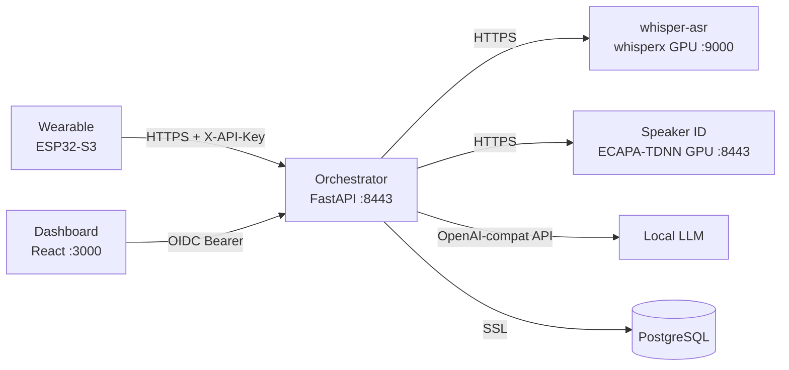

# Repository Guidelines

## Project Overview

LifeLog is a voice-activated life journal. A wearable recorder (XIAO ESP32-S3 + PDM mic) captures audio, compresses it with Opus, and uploads via HTTPS. A FastAPI orchestrator runs a pipeline: transcribe + diarize (whisperx via whisper-asr), identify speakers (ECAPA-TDNN), summarize (local LLM via OpenAI-compatible API), and store results in PostgreSQL. A React dashboard provides calendar browsing, recording playback with speaker segments, TODO/decision views, and speaker labeling with retroactive re-identification.

## Architecture & Data Flow



**Key architectural decisions:**
- **Integrated ASR + diarization**: whisper-asr runs whisperx which handles both transcription and speaker diarization in one service (no separate diarization microservice)
- **Background worker**: `worker.py` polls for pending utterances and runs the full pipeline asynchronously
- **Stateless GPU services**: Voiceprints are passed in HTTP request bodies, not fetched from DB
- **Per-user encryption**: Audio encrypted with Fernet keys derived via PBKDF2 from user-specific secrets
- **Independent auth**: Device uploads use `X-API-Key`; dashboard uses OIDC JWT. Both map to the same user row
- **DB isolation**: Only the orchestrator connects to PostgreSQL. GPU services have zero DB access

## Key Directories

```
lifelog/
├── server/src/lifelog/    FastAPI orchestrator (Python)
│   ├── routes/            upload.py, dashboard.py, speakers.py
│   ├── pipeline/          transcribe.py, speaker_client.py, llm.py
│   ├── worker.py          Background pipeline orchestrator (polls queue)
│   ├── models.py          Pydantic request/response models
│   ├── database.py        PostgreSQL (asyncpg, only DB-connected service)
│   ├── auth.py            API key + OIDC validation
│   └── crypto.py          Per-user Fernet audio encryption
├── whisper-asr/           whisperx ASR + diarization service (GPU)
├── speaker-id/src/        ECAPA-TDNN microservice (Python)
├── dashboard/src/         React SPA (TypeScript)
│   ├── components/        Calendar, RecordingDetail, AudioPlayer, TodoList, etc.
│   ├── api/client.ts      API client with fetch
│   └── test/              Vitest + testing-library tests
├── firmware-ota/          ESP32-S3 OTA firmware (C++/Arduino)
├── e2e/                   End-to-end test suite (Piper TTS → upload → verify)
├── scripts/               generate-certs.sh (TLS cert generation)
├── docker-compose.yml     Orchestrates all services
└── AGENTS.md              This file
```

## Development Commands

### Server orchestrator
```bash
cd server
uv venv .venv
uv pip install -e ".[dev]"
.venv/bin/python -m pytest tests/ -v          # Run all tests
.venv/bin/python -m pytest tests/ --cov=src/lifelog --cov-report=term-missing  # With coverage
uvicorn lifelog.main:app --reload --host 0.0.0.0 --port 8443 \
  --ssl-keyfile=certs/server.key --ssl-certfile=certs/server.crt
```

### Whisper ASR
```bash
cd whisper-asr
docker build -t whisper-asr .
# Run with GPU (requires nvidia-docker):
docker run --gpus all -p 9000:9000 whisper-asr
# Or via docker-compose (includes GPU reservation):
docker-compose up whisper-asr
```

### Speaker ID service
```bash
cd speaker-id
uv venv .venv && uv pip install -e ".[dev]"
.venv/bin/python -m pytest tests/ -v
uvicorn speaker_id.main:app --reload --host 0.0.0.0 --port 8443 \
  --ssl-keyfile=certs/server.key --ssl-certfile=certs/server.crt
```

### Dashboard
```bash
cd dashboard
npm install
npm run dev          # Vite dev server on :5173, proxies /api to server:8443
npm test             # Vitest run
npm run test:watch   # Vitest watch mode
npm run build        # Production build
```

### Firmware-OTA
```bash
cd firmware-ota
pio run                              # Build only
pio run -t upload                    # Upload via OTA (requires WiFi)
pio test -e test                     # Run native tests (68 tests)
pio device monitor                   # Serial monitor (115200 baud)
```

**⚠️ XIAO ESP32-S3 Sense hardware gotchas:**
- Built-in mic is **PDM** (not I2S): `I2S_MODE_PDM` with CLK=42, DIN=41
- SD card CS pin is **GPIO 21** (not GPIO 3)
- I2S DMA and FSPI (SD) share internal bus — buffer audio in RAM, write after recording stops
- Arduino ESP32 core 2.x: use `driver/i2s.h`, not `ESP_I2S.h`
- SD SPI clock: 25MHz (`SD.begin(SD_CS_PIN, SPI, 25000000)`)
- Model partition: mmap'd binary, NOT SPIFFS. See `firmware-ota/AGENTS.md` for rebuild instructions

### Infrastructure
```bash
./scripts/generate-certs.sh   # Generate TLS certs for all services
docker-compose up -d           # Start all services
docker-compose ps              # Check status
docker-compose logs -f server  # Tail orchestrator logs
```

### All tests at once
```bash
# Python services (each in its own venv)
cd server && .venv/bin/python -m pytest tests/ -q        # 77 tests
cd diarization && .venv/bin/python -m pytest tests/ -q   # 8 tests
cd speaker-id && .venv/bin/python -m pytest tests/ -q    # 15 tests

# Dashboard
cd dashboard && npx vitest run                            # 58 tests

# Firmware-OTA
cd firmware-ota && pio test -e test                       # 68 tests
```

## Code Conventions & Common Patterns

### Python services (server, speaker-id)

**Async pattern**: All DB and HTTP operations use `async/await`. FastAPI routes are `async def`. Database access uses `asyncpg` with `async with pool.acquire() as conn:`.

**Background worker**: `worker.py` runs a polling loop (`POLL_INTERVAL = 60s`) that claims pending utterances from the queue, runs the full pipeline (transcribe → identify → summarize), and saves the recording. Uses `claim_utterance()` with atomic DB update to prevent duplicate processing.

**Config**: `pydantic-settings` `BaseSettings` with `.env` file support. Settings are a module-level singleton:
```python
# config.py
from pydantic_settings import BaseSettings
class Settings(BaseSettings):
    some_value: str = "default"
    class Config:
        env_file = ".env"
settings = Settings()
```

**FastAPI dependency injection**: Routes use `Depends()` for auth. Tests use `app.dependency_overrides[original_func] = mock_func` rather than patching the module — this is critical because FastAPI captures the dependency reference at route registration time.

**Database mocking**: `pool.acquire()` returns an async context manager. Mock pattern:
```python
class MockPoolConnection:
    def __init__(self, conn): self._conn = conn
    async def __aenter__(self): return self._conn
    async def __aexit__(self, *args): return False

pool = MagicMock()
pool.acquire.return_value = MockPoolConnection(mock_conn)
```

**Heavy ML dep mocking**: pyannote, torch, and speechbrain are mocked via `sys.modules` in `conftest.py` before any application imports:
```python
# conftest.py
import sys
from unittest.mock import MagicMock
for mod in ["pyannote", "pyannote.audio", "torch"]:
    if mod not in sys.modules:
        sys.modules[mod] = MagicMock()
```

**Pydantic models**: Used for request/response validation (`SpeakerLabel`, `UploadResponse`). All fields use `Optional[str] = None` pattern.

**Type annotations**: All functions have return type annotations. `dict | None` union syntax (Python 3.10+). `list[dict]` generic syntax.

**Imports**: Standard library → third-party → local. `from __future__ import annotations` not used. Relative imports within packages.

### Dashboard (TypeScript/React)

**Type safety**: All types defined in `src/types.ts`. Components use `import type` for type-only imports. No `: any` — uses `unknown`, domain types, or generics.

**State management**: Local `useState` + `useEffect` per component. No global state library. API calls in `useEffect` with mock in tests.

**Routing**: `react-router-dom` v6 with `MemoryRouter` in tests. `useParams()` for route params.

**Testing**: Vitest + React Testing Library + `@testing-library/user-event`. Heavy components mocked via `vi.mock('../api/client')`. `screen.getAllByText()` for multiple matches. `container.querySelector()` for CSS class assertions.

**Component pattern**: Each component is a default export in its own file. Props interfaces defined inline or imported from `types.ts`. No HOCs or render props — functional components only.

**API client**: Single `fetchApi` wrapper with path-based routing. Methods return parsed JSON. Errors throw on non-ok responses.

## Important Files

| File | Purpose |
|------|---------|
| `server/src/lifelog/routes/upload.py` | Chunked upload endpoint — receives audio chunks, creates utterance queue entries |
| `server/src/lifelog/worker.py` | Background pipeline orchestrator — polls queue, runs transcribe→identify→summarize |
| `server/src/lifelog/database.py` | All PostgreSQL queries (only DB-connected service) |
| `server/src/lifelog/models.py` | Pydantic request/response models (UserCreate, RecordingResponse, etc.) |
| `server/src/lifelog/auth.py` | API key + OIDC validation with `Depends()` |
| `server/src/lifelog/crypto.py` | Per-user Fernet encryption (PBKDF2 key derivation) |
| `server/src/lifelog/routes/speakers.py` | Speaker labeling + retroactive re-ID |
| `server/src/lifelog/pipeline/transcribe.py` | Whisper transcription client |
| `server/src/lifelog/pipeline/speaker_client.py` | Speaker identification client |
| `server/src/lifelog/pipeline/llm.py` | LLM prompt template + `summarize()` |
| `whisper-asr/Dockerfile` | whisperx ASR + diarization service (replaces separate diarization) |
| `speaker-id/src/speaker_id/routes.py` | `cosine_similarity()`, `match_voiceprint()`, `/identify` + `/enroll` |
| `speaker-id/src/speaker_id/embeddings.py` | ECAPA-TDNN `SpeakerEncoder` class |
| `dashboard/src/api/client.ts` | API client (all `fetchApi` calls) |
| `dashboard/src/types.ts` | All TypeScript interfaces |
| `dashboard/src/components/Calendar.tsx` | Main calendar view with month navigation |
| `dashboard/src/components/SpeakerLabel.tsx` | Speaker labeling UI |
| `docker-compose.yml` | Service orchestration, port mappings, GPU reservations |
| `scripts/generate-certs.sh` | TLS cert generation for all services |
| `server/entrypoint.sh` | Docker entrypoint — runs alembic migrations before starting server |
| `e2e/run_e2e.py` | End-to-end test suite — generates audio, uploads, verifies pipeline |
| `firmware-ota/src/main.cpp` | OTA firmware: WiFiManager, ArduinoOTA, PDM mic, SD card recording |
| `firmware-ota/src/audio.cpp` | Core audio engine: I2S, AFE, ring buffer, Opus/OGG, writer task |
| `firmware-ota/partitions/partitions_ota.csv` | Dual OTA partition table (3MB app slots + 1.9MB model) |
| `firmware-ota/platformio.ini` | OTA firmware build config |
| `firmware-ota/AGENTS.md` | Detailed firmware guide (architecture, build, model partition, tests) |

## Database Migrations

Schema changes are managed by [Alembic](https://alembic.sqlalchemy.org/) in `server/alembic/`.

**⚠️ CRITICAL: Never modify a committed migration file.** Migration files in `server/alembic/versions/` are immutable once committed. If you need to change the schema, create a **new** migration file that applies the change via `ALTER TABLE`, `CREATE INDEX`, etc. Modifying an existing migration breaks anyone who already ran it.

**Workflow:**
1. Edit the model/schema in `database.py` or write raw SQL
2. Generate a new migration: `cd server && alembic revision --autogenerate -m "description"`
3. Review the generated migration in `alembic/versions/`
4. Test it: `alembic upgrade head`
5. Commit the new migration file

**Current migrations:**
- `001_initial_schema.py` — Creates users, recordings, voiceprints tables with indexes
- `002_utterance_chunks.py` — Adds utterance chunks table for chunked uploads
- `003_utterance_queue.py` — Adds utterance queue for background worker processing
- `004_session_grouping.py` — Adds session grouping and reprocessing support

**Running migrations:**
- Automatically on server startup (via `init_db()` in `main.py` lifespan)
- Manually: `cd server && alembic upgrade head`
- Rollback: `cd server && alembic downgrade -1`

## Runtime/Tooling Preferences

| Component | Runtime | Package Manager | Build Tool |
|-----------|---------|----------------|------------|
| Server | Python 3.11+ | `uv` (preferred) / pip | hatchling |
| Speaker ID | Python 3.11+ | `uv` / pip | hatchling |
| Whisper ASR | Python 3.11+ | pip | whisperx + pyannote |
| Dashboard | Node.js 20+ | npm | Vite 5 |
| Firmware-OTA | PlatformIO | pio lib | Arduino framework (2.x) |
| Docker | Docker Compose v3.8 | — | Multi-stage builds |

**Constraints:**
- Python services use `uv` for venv creation and dependency management
- No Python lockfiles exist — builds use floating `>=` constraints
- Dashboard has `package-lock.json` for reproducible npm installs
- Firmware targets `seeed_xiao_esp32s3` board with `partitions_ota.csv` (dual 3MB app slots + 1.9MB model)
- Docker images use `python:3.11-slim` base; dashboard uses `node:20-alpine` → `nginx:alpine`
- GPU services require NVIDIA runtime with CUDA
- SSL certs are generated at compose level (command overrides), not baked into Dockerfiles

## Testing & QA

**Total**: ~148 tests across 5 components (77 server + 8 diarization + 15 speaker-id + 58 dashboard + 68 firmware-ota)

### Python test framework
- **pytest** with `pytest-asyncio` (`asyncio_mode = "auto"`)
- **Coverage**: `pytest-cov` — server at 93%, diarization at 93%, speaker-id at 95%
- Tests run per-component in isolated venvs: `cd server && .venv/bin/python -m pytest tests/ -q`

### Dashboard test framework
- **Vitest** with `jsdom` environment, `@testing-library/react`, `@testing-library/user-event`
- Config: `vitest.config.ts` with `globals: true`, setup file at `src/test/setup.ts`
- Run: `cd dashboard && npx vitest run`

### What's tested
| Area | Coverage | Approach |
|------|----------|----------|
| Database CRUD | ~20 functions | Mock asyncpg pool with `MockPoolConnection` |
| Auth (API key + OIDC) | 2 functions | Real RSA key generation for OIDC tests |
| Crypto (encrypt/decrypt) | 4 methods | Full roundtrip with temp dirs |
| Pipeline clients | 3 functions | Mock httpx/LLM |
| Route endpoints | 10+ routes | FastAPI `TestClient` + `dependency_overrides` |
| Dashboard components | 7 components | `vi.mock` API client, `render` + `screen` queries |
| API client | 8 methods | `vi.stubGlobal('fetch')` with mock responses |
| ML pipeline | 3 functions | `sys.modules` mocking for pyannote/torch/speechbrain |
| Firmware-OTA | 68 tests | Native Unity tests with full ESP32/FreeRTOS mock layer |

### Key testing patterns
- **FastAPI routes**: Always use `app.dependency_overrides[validate_oidc_token]` (not `patch`) — FastAPI captures dependency references at import time
- **asyncpg pool**: `pool.acquire()` must return an async context manager (not a coroutine) — use `MockPoolConnection` class
- **Heavy ML imports**: Mock entire modules via `sys.modules` in `conftest.py` before any app imports
- **React components**: Wrap in `<MemoryRouter>` when component uses `<Link>` or `useParams()`
- **Audio elements**: jsdom doesn't implement `HTMLMediaElement.play()` — tests only verify button text toggles, not actual playback
- **Firmware tests**: ⚠️ Tests re-implement functions from source (don't `#include` actual `.cpp`). They verify algorithm correctness, not code integration. See `firmware-ota/AGENTS.md` for details.

## Code Quality

### Linters and type checkers

| Service | Tool | Command |
|---------|------|---------|
| Server (Python) | ruff | `cd server && .venv/bin/ruff check src/ tests/` |
| Speaker ID (Python) | ruff | `cd speaker-id && .venv/bin/ruff check src/ tests/` |
| Dashboard (TypeScript) | tsc | `cd dashboard && npx tsc --noEmit` |
| Firmware-OTA (C++) | — | PlatformIO compiler warnings |

### Test-after-change rule

Every code change MUST be followed by running the relevant test suite before yielding. If tests fail, fix in the same pass — never deliver with broken tests.

- **Python services**: `cd <service> && .venv/bin/python -m pytest tests/ -q`
- **Dashboard**: `cd dashboard && npx vitest run`
- **Firmware-OTA**: `cd firmware-ota && pio test -e test`

### Pre-commit checklist (code complete)

Before merging any change:

1. **Lint**: `ruff check src/ tests/` passes on all Python services (0 errors)
2. **Type check**: `npx tsc --noEmit` passes on dashboard (0 errors)
3. **Tests**: All ~148 tests pass across all 5 services
4. **No regressions**: Existing functionality not broken

### Ruff configuration

Python services use these ruff rules (in `pyproject.toml`):

```toml
[tool.ruff]
target-version = "py311"

[tool.ruff.lint]
ignore = [
    "B008",   # FastAPI Depends() in function signatures — standard pattern
    "SIM117", # nested with — readability preference in tests
]

[tool.ruff.lint.per-file-ignores]
"tests/*" = ["S110", "BLE001"]  # try-except-pass in tests is intentional
```

### TypeScript strictness

Dashboard uses `strict: true` in `tsconfig.json`. No `: any` allowed — use `unknown`, domain types, or generics.

## Build Scripts

Each component has a `build.sh` that runs its full verification pipeline. The top-level `build.sh` runs all of them.

| Script | Steps |
|--------|-------|
| `build.sh` | Runs all component builds, reports pass/fail |
| `server/build.sh` | compile check → ruff lint → pytest (77 tests) |
| `diarization/build.sh` | compile check → ruff lint → pytest (8 tests) |
| `speaker-id/build.sh` | compile check → ruff lint → pytest (15 tests) |
| `dashboard/build.sh` | tsc type check → vite build → vitest (58 tests) → bundle size |
| `firmware-ota/build.sh` | pio compile check → native test (68 tests) |

**Run everything:**
```bash
./build.sh           # Full build, all components
./server/build.sh    # Single component
```

**Exit code:** 0 = all passed, 1 = failures detected. CI-friendly.
