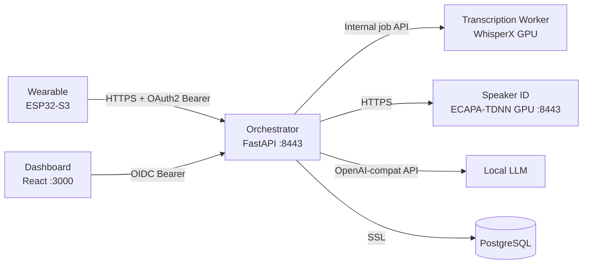

# Repository Guidelines

## ⚠️ Commit Rule

**NEVER commit directly to `main`.** All changes must go through a pull request.

**NEVER commit changes without explicit user instruction.** Always ask before running `git commit`. The user decides when changes are ready to commit. **REMIND the user to commit** when a task appears to be working and changes are stable — don't let working changes sit uncommitted.

**Squash merge only.** When merging a PR, always use squash merge. This keeps `main` history linear and each commit atomic. Delete the feature branch after merge.

## ⚠️ Branch Rule

**Trunk-based development.** `main` is the single source of truth. All work happens on short-lived feature branches.

**Branch naming:** All work uses `feature/` branches with descriptive kebab-case names:
- `feature/user-disk-limits`
- `feature/speaker-identification-fix`
- `feature/update-deps`

**Before starting work:**
1. Ensure `main` is up to date: `git pull origin main`
2. Create a branch: `git checkout -b <branch-name>`
3. Work on the branch; commit frequently with clear messages

**PR requirements:**
- Every PR targets `main`
- PR title must use [Conventional Commits](https://www.conventionalcommits.org/) format: `feat:`, `fix:`, `chore:`, `docs:`, `test:`, `refactor:` — this becomes the squash commit message
- All CI checks must pass before merge
- Squash merge (no merge commits, no rebase merges)
- Delete branch after merge

**Long-lived branches are prohibited.** If a branch lives more than a few days, it's too big — break it into smaller PRs. The only exception is `release/*` branches for versioned releases (not applicable until needed).

## ⚠️ Documentation Sync Rule

## Project Overview

LifeLog is a voice-activated life journal. A wearable recorder (XIAO ESP32-S3 + PDM mic) captures audio, compresses it with Opus, and uploads via HTTPS. A FastAPI orchestrator encrypts uploads, groups utterances into sessions, queues quick/full transcription jobs, finalizes completed jobs, identifies speakers (ECAPA-TDNN), summarizes (local LLM via OpenAI-compatible API), and stores results in PostgreSQL. A standalone GPU transcription worker runs WhisperX ASR/diarization through the internal job API. A React dashboard provides calendar browsing, recording playback with speaker segments, TODO/decision views, and speaker labeling with retroactive re-identification.

## Architecture & Data Flow



**Key architectural decisions:**

- **Asynchronous transcription**: the server owns encrypted audio, job state, session finalization, and persistence; the standalone transcription worker owns WhisperX ASR/diarization
- **Quick/full jobs**: uploads queue ASR-only quick jobs for live transcript display; ended sessions queue ten-minute full jobs for diarization, speaker audio, and finalization
- **Background worker**: `worker.py` polls uploads, applies quick results, queues full jobs, and finalizes completed sessions
- **Stateless GPU services**: Voiceprints and audio are passed in HTTP request bodies, not fetched from DB
- **Per-user encryption**: Audio encrypted with Fernet keys derived via PBKDF2 from user-specific secrets
- **Independent auth**: Device uploads use OAuth2 device code flow; dashboard uses OIDC JWT. Both map to the same user row
- **DB isolation**: Only the orchestrator connects to PostgreSQL. GPU services have zero DB access
- **ESP32 dashboard**: RisalDash replaces ESPUI+WiFiManager — handles WiFi captive portal, credential storage, reconnection, OTA updates, and real-time web dashboard via WebSocket

## Key Directories

```
lifelog/
├── server/src/lifelog/    FastAPI orchestrator (Python)
│   ├── routes/            upload.py, dashboard.py, speakers.py, transcription.py
│   ├── pipeline/          speaker_client.py, llm.py
│   ├── worker.py          Upload/session/job orchestrator
│   ├── models.py          Pydantic request/response models
│   ├── database.py        PostgreSQL (asyncpg, only DB-connected service)
│   ├── auth.py            API key + OIDC validation
│   ├── crypto.py          Per-user Fernet audio encryption
│   └── rate_limit.py      Shared rate limiter instance (slowapi)
├── transcription-worker/  Standalone WhisperX ASR + diarization GPU worker
├── speaker-id/src/        ECAPA-TDNN microservice (Python)
├── dashboard/src/         React SPA (TypeScript)
│   ├── components/        AudioPlayer, Calendar, DecisionsList, RecordingDetail, RecordingList, SpeakerLabel, TodoList
│   ├── api/client.ts      API client with fetch (oidc-client-ts integration)
│   ├── auth/              AuthContext.tsx, ProtectedRoute.tsx (OIDC auth state)
│   ├── pages/             CallbackPage.tsx, LandingPage.tsx (route pages)
│   ├── styles/global.css  Global stylesheet
│   ├── utils/format.ts    Shared formatting helpers
│   └── test/              Vitest + testing-library tests
├── firmware-ota/          ESP32-S3 OTA firmware (C++/Arduino)
│   ├── src/               main.cpp, audio.cpp, i2s_fe.cpp, writer.cpp, upload.cpp, oauth2_client.cpp + headers (audio.h, i2s_fe.h, writer.h, upload.h, oauth2_client.h, settings.h, config.h, afe_stubs.h)
│   ├── lib/               lifelog_core, oauth2_device_flow, taskman
│   └── test/              Unity native tests (69 tests)
├── e2e/                   End-to-end test suite (Piper TTS → upload → verify)
├── scripts/               generate-certs.sh (TLS cert generation)
├── docker-compose.yml     Orchestrates all services
└── AGENTS.md              This file
```

## Development Commands

### Server orchestrator

```bash
cd server
uv venv .venv
uv pip install -e ".[dev]"
.venv/bin/python -m pytest tests/ -v          # Run all tests
.venv/bin/python -m pytest tests/ --cov=src/lifelog --cov-report=term-missing  # With coverage
uvicorn lifelog.main:app --reload --host 0.0.0.0 --port 8443 \
  --ssl-keyfile=certs/server.key --ssl-certfile=certs/server.crt
```

### Transcription worker

```bash
cd transcription-worker
uv venv .venv && uv pip install -e ".[dev]"
.venv/bin/python -m pytest -q
uvicorn main:app --host 0.0.0.0 --port 9000  # requires CUDA, HF_TOKEN, and model cache
```

The worker owns WhisperX model inference and polls the server's internal job API every five seconds by default.

### Speaker ID service

```bash
cd speaker-id
uv venv .venv && uv pip install -e ".[dev]"
.venv/bin/python -m pytest tests/ -v
uvicorn speaker_id.main:app --reload --host 0.0.0.0 --port 8443 \
  --ssl-keyfile=certs/server.key --ssl-certfile=certs/server.crt
```

### Dashboard

```bash
cd dashboard
npm install
npm run dev          # Vite dev server on :5173, proxies /api to server:8443
npm test             # Vitest run
npm run test:watch   # Vitest watch mode
npm run build        # Production build
```

### Firmware-OTA

```bash
cd firmware-ota
pio run                              # Build only
pio test -e test                     # Run native tests (69 tests)
pio device monitor                   # Serial monitor (115200 baud)

# OTA update (HTTP, not ArduinoOTA):
curl -X POST -F "firmware=@.pio/build/xiao_esp32s3/firmware.bin" \
  http://<device-ip>/update
```

**⚠️ XIAO ESP32-S3 Sense hardware gotchas:**

- Built-in mic is **PDM** (not I2S): `I2S_MODE_PDM` with CLK=42, DIN=41
- SD card CS pin is **GPIO 21** (not GPIO 3)
- I2S DMA and FSPI (SD) share internal bus — buffer audio in RAM, write after recording stops
- Arduino ESP32 core 3.x: use `driver/i2s_pdm.h` + `driver/i2s_common.h` (new channel API), not legacy `driver/i2s.h`
- SD SPI clock: 25MHz (`SD.begin(SD_CS_PIN, SPI, 25000000)`)
- Model partition: mmap'd binary, NOT SPIFFS. See `firmware-ota/AGENTS.md` for rebuild instructions

### Infrastructure

```bash
./scripts/generate-certs.sh   # Generate TLS certs for all services
docker-compose up -d           # Start all services
docker-compose ps              # Check status
docker-compose logs -f server  # Tail orchestrator logs
```

### All tests at once

```bash
# Python services (each in its own venv)
cd server && .venv/bin/python -m pytest tests/ -q        # 134 tests
cd diarization && .venv/bin/python -m pytest tests/ -q   # 8 tests
cd speaker-id && .venv/bin/python -m pytest tests/ -q    # 14 tests
cd transcription-worker && python -m pytest -q           # 10 tests

# Dashboard
cd dashboard && npx vitest run                            # 91 tests

# Firmware-OTA
cd firmware-ota && pio test -e test                       # 69 tests
```

## Code Conventions & Common Patterns

### Python services (server, speaker-id)

**Async pattern**: All DB and HTTP operations use `async/await`. FastAPI routes are `async def`. Database access uses `asyncpg` with `async with pool.acquire() as conn:`.

**Background worker**: `worker.py` claims upload queue entries, encrypts and groups utterances, applies quick results, queues ten-minute full jobs, and finalizes completed sessions. The separate `transcription-worker` claims GPU jobs and reports ASR/diarization results.

**Config**: `pydantic-settings` `BaseSettings` with `.env` file support. Settings are a module-level singleton:

```python
# config.py
from pydantic_settings import BaseSettings
class Settings(BaseSettings):
    some_value: str = "default"
    class Config:
        env_file = ".env"
settings = Settings()
```

**FastAPI dependency injection**: Routes use `Depends()` for auth. Tests use `app.dependency_overrides[original_func] = mock_func` rather than patching the module — this is critical because FastAPI captures the dependency reference at route registration time.

**Database mocking**: `pool.acquire()` returns an async context manager. Mock pattern:

```python
class MockPoolConnection:
    def __init__(self, conn): self._conn = conn
    async def __aenter__(self): return self._conn
    async def __aexit__(self, *args): return False

pool = MagicMock()
pool.acquire.return_value = MockPoolConnection(mock_conn)
```

**Heavy ML dep mocking**: pyannote, torch, and speechbrain are mocked via `sys.modules` in `conftest.py` before any application imports:

```python
# conftest.py
import sys
from unittest.mock import MagicMock
for mod in ["pyannote", "pyannote.audio", "torch"]:
    if mod not in sys.modules:
        sys.modules[mod] = MagicMock()
```

**Pydantic models**: Used for request/response validation (`SpeakerLabel`, `UploadResponse`). All fields use `Optional[str] = None` pattern.

**Type annotations**: All functions have return type annotations. `dict | None` union syntax (Python 3.10+). `list[dict]` generic syntax.

**Imports**: Standard library → third-party → local. `from __future__ import annotations` not used. Relative imports within packages.

### Dashboard (TypeScript/React)

**Type safety**: All types defined in `src/types.ts`. Components use `import type` for type-only imports. No `: any` — uses `unknown`, domain types, or generics.

**State management**: Local `useState` + `useEffect` per component. No global state library. API calls in `useEffect` with mock in tests.

**Routing**: `react-router-dom` v6 with `MemoryRouter` in tests. `useParams()` for route params.

**Testing**: Vitest + React Testing Library + `@testing-library/user-event`. Heavy components mocked via `vi.mock('../api/client')`. `screen.getAllByText()` for multiple matches. `container.querySelector()` for CSS class assertions.

**Component pattern**: Each component is a default export in its own file. Props interfaces defined inline or imported from `types.ts`. No HOCs or render props — functional components only.

**API client**: Single `fetchApi` wrapper with path-based routing. Methods return parsed JSON. Errors throw on non-ok responses.

**Auth**: OIDC integration via `oidc-client-ts` `UserManager`. `AuthContext` provides auth state to the app. `ProtectedRoute` wraps routes requiring authentication.

## Important Files

| File | Purpose |
|------|---------|
| `server/src/lifelog/routes/upload.py` | Chunked upload endpoint — receives audio chunks, creates utterance queue entries |
| `server/src/lifelog/routes/transcription.py` | Internal claim/audio/stage/complete/fail API for the GPU transcription worker |
| `server/src/lifelog/worker.py` | Upload/session/job orchestrator — quick transcript application and full-session finalization |
| `server/src/lifelog/database.py` | All PostgreSQL queries, including transcription job state transitions |
| `server/src/lifelog/models.py` | Pydantic request/response models (UserCreate, RecordingResponse, etc.) |
| `server/src/lifelog/auth.py` | API key + OIDC validation with `Depends()` |
| `server/src/lifelog/crypto.py` | Per-user Fernet audio encryption (PBKDF2 key derivation) |
| `server/src/lifelog/validation.py` | Input validation and prompt injection defense for user-supplied LLM context |
| `server/src/lifelog/routes/speakers.py` | Speaker labeling, encrypted segment extraction, and retroactive re-ID |
| `server/src/lifelog/pipeline/speaker_client.py` | Audio-bearing speaker identification client |
| `server/src/lifelog/pipeline/llm.py` | LLM prompt template + `summarize()` |
| `transcription-worker/audio.py` | ffmpeg decoding and timestamp-aware waveform assembly |
| `transcription-worker/pipeline.py` | Process-global WhisperX ASR/alignment/diarization and segment extraction |
| `transcription-worker/main.py` | GPU job poller and health endpoint |
| `transcription-worker/Dockerfile` | CUDA worker image |
| `speaker-id/src/speaker_id/routes.py` | `cosine_similarity()`, `match_voiceprint()`, audio-aware `/identify` + `/enroll` |
| `speaker-id/src/speaker_id/embeddings.py` | ECAPA-TDNN `SpeakerEncoder` class |
| `dashboard/src/api/client.ts` | API client (all `fetchApi` calls, oidc-client-ts integration) |
| `dashboard/src/types.ts` | All TypeScript interfaces |
| `dashboard/src/auth/AuthContext.tsx` | OIDC auth context and UserManager integration |
| `dashboard/src/auth/ProtectedRoute.tsx` | Route guard for OIDC-authenticated pages |
| `dashboard/src/pages/CallbackPage.tsx` | OIDC callback handler page |
| `dashboard/src/pages/LandingPage.tsx` | Unauthenticated landing page |
| `dashboard/src/utils/format.ts` | Shared formatting helpers |
| `dashboard/src/components/Calendar.tsx` | Main calendar view with month navigation |
| `dashboard/src/components/SpeakerLabel.tsx` | Speaker labeling UI |
| `dashboard/src/components/Settings.tsx` | User settings UI for language preference and LLM context |
| `scripts/generate-certs.sh` | TLS cert generation for all services |
| `server/entrypoint.sh` | Docker entrypoint — runs alembic migrations before starting server |
| `e2e/run_e2e.py` | End-to-end test suite — generates audio, uploads, verifies pipeline |
| `firmware-ota/src/main.cpp` | OTA firmware: WiFi, OTA, PDM mic, SD card, runtime log levels |
| `firmware-ota/src/audio.cpp` | Ring buffer + producer (audioInit, sdTake/sdGive) |
| `firmware-ota/src/i2s_fe.cpp` | I2S PDM driver, AFE init, feed/fetch tasks, processAfeResult |
| `firmware-ota/src/writer.cpp` | Consumer: Opus/OGG encode, PSRAM-first buffering, SD fallback, upload queue |
| `firmware-ota/src/oauth2_client.cpp` | ESP32 OAuth2 client — wires device flow library to NVS storage |
| `firmware-ota/partitions/partitions_ota.csv` | Dual OTA partition table (3MB app slots + 1.9MB model) |
| `firmware-ota/platformio.ini` | OTA firmware build config |
| `firmware-ota/AGENTS.md` | Detailed firmware guide (architecture, build, model partition, tests) |
| `firmware-ota/ARCHITECTURE.md` | Firmware architecture deep-dive with PlantUML diagrams (tasks, cores, data flow, synchronization) |

## Database Migrations

Schema changes are managed by [Alembic](https://alembic.sqlalchemy.org/) in `server/alembic/`.

**⚠️ CRITICAL: Never modify a committed migration file.** Migration files in `server/alembic/versions/` are immutable once committed. If you need to change the schema, create a **new** migration file that applies the change via `ALTER TABLE`, `CREATE INDEX`, etc. Modifying an existing migration breaks anyone who already ran it.

**Workflow:**

1. Edit the model/schema in `database.py` or write raw SQL
2. Generate a new migration: `cd server && alembic revision --autogenerate -m "description"`
3. Review the generated migration in `alembic/versions/`
4. Test it: `alembic upgrade head`
5. Commit the new migration file

**Current migrations:**

- `001_initial_schema.py` — Creates users, recordings, voiceprints tables with indexes
- `002_utterance_chunks.py` — Adds utterance chunks table for chunked uploads
- `003_utterance_queue.py` — Adds utterance queue for background worker processing
- `004_session_grouping.py` — Adds session grouping and reprocessing support
- `005_daily_summaries.py` — Adds daily summaries table
- `006_drop_is_meaningful_add_category.py` — Drops is_meaningful column, adds category
- `007_todos_table.py` — Adds todos table
- `009_decisions_table.py` — Adds decisions table
- `010_nullable_recording_id.py` — Makes recording_id nullable
- `011_user_key_salt.py` — Adds user key salt for encryption
- `012_transcription_jobs.py` — Adds asynchronous transcription job state
- `013_transcription_job_retry.py` — Adds bounded transcription retries
- `014_cleanup_duplicate_transcription_jobs.py` — Cleans duplicate jobs
- `015_quick_transcription_job_type.py` — Distinguishes quick and full jobs
- `016_speaker_segments.py` — Adds encrypted speaker segment metadata to recordings
- `020_job_language.py` — Adds language column to transcription_jobs table

**Running migrations:**

- Automatically on server startup (via `init_db()` in `main.py` lifespan)
- Manually: `cd server && alembic upgrade head`
- Rollback: `cd server && alembic downgrade -1`

## Runtime/Tooling Preferences

| Component | Runtime | Package Manager | Build Tool |
|-----------|---------|----------------|------------|
| Server | Python 3.11+ | `uv` (preferred) / pip | hatchling |
| Speaker ID | Python 3.11+ | `uv` / pip | hatchling |
| Transcription worker | Python 3.11+ | `uv` / pip | WhisperX + CUDA Torch |
| Dashboard | Node.js 24+ | npm | Vite 5 |
| Firmware-OTA | PlatformIO | pio lib | Arduino framework (2.x) |
| Docker | Docker Compose v3.8 | — | Multi-stage builds |

**Constraints:**

- Python services use `uv` for venv creation and dependency management
- No Python lockfiles exist — builds use floating `>=` constraints
- Dashboard has `package-lock.json` for reproducible npm installs
- Firmware targets `seeed_xiao_esp32s3` board with `partitions_ota.csv` (dual 3MB app slots + 1.9MB model)
- Docker images use CUDA runtime for GPU services; dashboard uses `node:24-alpine` → `nginx:alpine`
- GPU services require NVIDIA runtime with CUDA
- SSL certs are generated at compose level (command overrides), not baked into Dockerfiles

## Testing & QA

Each component has a `build.sh` that runs five gates when applicable. Failure of any gate exits non-zero and blocks the PR via the GitHub Actions job red status.

### Build gates (component `build.sh`)

| # | Gate | What it catches |
|---|------|-----------------|
| 1 | `python -m py_compile` (per `.py` file) | Syntax errors |
| 2 | `ruff check src/ tests/` | Style, bug-prone patterns (B008 excepted for FastAPI Depends) |
| 3 | `ruff format --check` | Format drift (run `ruff format` to fix) |
| 4 | `pip-audit` (frozen, excluding the local editable package; suppresses `[#4/5]` failures only for IDs listed in the repo-root `.ignoreVuln`) | Python dependency CVEs (PyPI advisory / OSV database) |
| 5 | `pytest -q` (server also runs `--cov --cov-report=term-missing`) | Failing behaviour; server additionally reports per-file coverage |

### Accepted vulnerability list — `.ignoreVuln`

The repo-root [`.ignoreVuln`](.ignoreVuln) is the **single source of truth** for CVE IDs accepted as residual risk. Each Python service `build.sh` reads it and passes every entry as a `--ignore-vuln ID` flag to pip-audit, so gate `[4/5]` reflects only what we consider blockers.

- One OSV / pip-audit vulnerability ID per line.
- `#`-prefixed lines and blank lines are ignored.
- Comments above each entry should cite the upstream fix reference (commit SHA, release tag) so the next maintainer knows exactly when to drop it.
- Adding an entry is a deliberate acceptance of risk; deleting one is a normal dependency-update step (delete the line, run the service `build.sh` to confirm the gate stays green, and pin the patched release floor in `pyproject.toml` if needed).
- Currently: `PYSEC-2026-3624` (lightning, transitive via pyannote.audio) — upstream fix committed (`d710d68`, 2026-07-14) but no PyPI release yet. Drop the entry when `lightning>=2.6.6` is available and pyannote.audio resolves to it.

For C++/TypeScript/Python alternatives: the **dashboard** build runs `npm ci` → `npm run test` (Vitest 91 tests) → `npx tsc --noEmit` (strict type-check) → bundle size check (340K cap). **firmware-ota** runs `pio test -e test` (69 Unity native tests).

### Failing the build

A failed build produces `conclusion: failure` for that component's job in `ci.yml`, marking the PR as failing the GitHub status check. Squashing the PR to `main` requires the check to pass if branch protection is configured. Without branch protection, the merge button stays clickable — enable "Require status checks to pass" in repository Settings → Branches to enforce.

### Test counts

Total: **~326 tests** across 6 components (134 server + 8 diarization + 16 speaker-id + 10 transcription-worker + 91 dashboard + 69 firmware-ota).

### Python test framework

- **pytest** with `pytest-asyncio` (`asyncio_mode = "auto"`)
- **Coverage**: `pytest-cov` — server at 93%, diarization at 93%, speaker-id at 95%
- Tests run per-component in isolated venvs: `cd server && .venv/bin/python -m pytest tests/ -q`

### Dashboard test framework

- **Vitest** with `jsdom` environment, `@testing-library/react`, `@testing-library/user-event`
- Config: `vitest.config.ts` with `globals: true`, setup file at `src/test/setup.ts`
- Run: `cd dashboard && npx vitest run`

### What's tested

| Area | Coverage | Approach |
|------|----------|----------|
| Database CRUD | ~20 functions | Mock asyncpg pool with `MockPoolConnection` |
| Auth (API key + OIDC) | 2 functions | Real RSA key generation for OIDC tests |
| Crypto (encrypt/decrypt) | 4 methods | Full roundtrip with temp dirs |
| Pipeline clients | 3 functions | Mock httpx/LLM |
| Route endpoints | 10+ routes | FastAPI `TestClient` + `dependency_overrides` |
| Dashboard components | 7 components | `vi.mock` API client, `render` + `screen` queries |
| API client | 8 methods | `vi.stubGlobal('fetch')` with mock responses |
| ML pipeline | 3 functions | `sys.modules` mocking for pyannote/torch/speechbrain |
| Firmware-OTA | 69 tests | Native Unity tests with full ESP32/FreeRTOS mock layer |

### Key testing patterns

- **FastAPI routes**: Always use `app.dependency_overrides[validate_oidc_token]` (not `patch`) — FastAPI captures dependency references at import time
- **asyncpg pool**: `pool.acquire()` must return an async context manager (not a coroutine) — use `MockPoolConnection` class
- **Heavy ML imports**: Mock entire modules via `sys.modules` in `conftest.py` before any app imports
- **React components**: Wrap in `<MemoryRouter>` when component uses `<Link>` or `useParams()`
- **Audio elements**: jsdom doesn't implement `HTMLMediaElement.play()` — tests only verify button text toggles, not actual playback
- **Firmware tests**: ⚠️ Tests re-implement functions from source (don't `#include` actual `.cpp`). They verify algorithm correctness, not code integration. See `firmware-ota/AGENTS.md` for details.

## Code Quality

### Linters and type checkers

| Service | Tool | Command |
|---------|------|---------|
| Server (Python) | ruff | `cd server && .venv/bin/ruff check src/ tests/` |
| Speaker ID (Python) | ruff | `cd speaker-id && .venv/bin/ruff check src/ tests/` |
| Transcription worker (Python) | ruff | `cd transcription-worker && ruff check .` |
| Dashboard (TypeScript) | tsc | `cd dashboard && npx tsc --noEmit` |
| Firmware-OTA (C++) | — | PlatformIO compiler warnings |

### Test-after-change rule

Every code change MUST be followed by running the relevant test suite before yielding. If tests fail, fix in the same pass — never deliver with broken tests.

- **Python services**: `cd <service> && .venv/bin/python -m pytest tests/ -q`
- **Transcription worker**: `cd transcription-worker && python -m pytest -q`
- **Dashboard**: `cd dashboard && npx vitest run`
- **Firmware-OTA**: `cd firmware-ota && pio test -e test`

### Pre-commit checklist (code complete)

Before merging any change:

1. **Lint**: `ruff check src/ tests/` passes on all Python services (0 errors)
2. **Type check**: `npx tsc --noEmit` passes on dashboard (0 errors)
3. **Tests**: All ~303 tests pass across all 6 components
4. **No regressions**: Existing functionality not broken

### Ruff configuration

Python services use these ruff rules (in `pyproject.toml`):

```toml
[tool.ruff]
target-version = "py311"

[tool.ruff.lint]
ignore = [
    "B008",   # FastAPI Depends() in function signatures — standard pattern
    "SIM117", # nested with — readability preference in tests
]

[tool.ruff.lint.per-file-ignores]
"tests/*" = ["S110", "BLE001"]  # try-except-pass in tests is intentional
```

### TypeScript strictness

Dashboard uses `strict: true` in `tsconfig.json`. No `: any` allowed — use `unknown`, domain types, or generics.

## Build Scripts

Each component has a `build.sh` that runs its full verification pipeline. The top-level `build.sh` runs all of them. Python-service scripts (`server/build.sh`, `diarization/build.sh`, `speaker-id/build.sh`) bootstrap a `.venv` with `uv venv .venv && uv pip install -e ".[dev]"` if missing, then run ruff + pytest against it.

| Script | Steps |
|--------|-------|
| `build.sh` | Runs all component builds, reports pass/fail |
| `server/build.sh` | venv bootstrap (uv) → ruff lint → pytest (134 tests) |
| `diarization/build.sh` | venv bootstrap (uv) → ruff lint → pytest (8 tests) |
| `speaker-id/build.sh` | venv bootstrap (uv) → ruff lint → pytest (16 tests) |
| `dashboard/build.sh` | tsc type check → vite build → vitest (91 tests) → bundle size |
| `transcription-worker/build.sh` | venv bootstrap (uv) → ruff lint → py_compile → pytest (10 tests) |

**Run everything:**

```bash
./build.sh           # Full build, all components
./server/build.sh    # Single component
```


## Continuous Integration

GitHub Actions runs the verification pipeline on every PR and on every push to `main`. Three workflows live under `.github/workflows/`:

- `ci.yml` — **PR only** trigger (`opened` / `synchronize` / `reopened`). The post-merge CodeQL scan lives in `main.yml`'s `security` job, not here — having a `push: branches: [main]` hook on this workflow would cause every merge to fire two parallel workflows, doubling CI cost for no benefit. The PR scan is enough to catch issues before merge; the post-merge scan re-runs CodeQL on the merged tree so Code Scanning has both PR scans and a default-branch scan target.
  ```
  detect-changes               (dorny/paths-filter@v3)
  ├── server
  ├── diarization
  ├── speaker-id
  ├── transcription-worker
  ├── dashboard
  ├── firmware
  └── security
  ```
  `detect-changes` is a single job that uses `dorny/paths-filter@v3` to emit bools (`server`, `diarization`, `speaker-id`, `transcription-worker`, `dashboard`, `firmware`, `python-source`, `ci-config`) by glob-matching the PR's changed paths. Downstream jobs declare `needs: detect-changes` and gate on the corresponding output (`if: needs.detect-changes.outputs.<x> == 'true'`). The `ci-config` filter matches `.github/workflows/**`, `AGENTS.md`, and `README.md` and is OR'd into every downstream gate; touching CI files re-validates the entire surface area (a path-filter or workflow change should not go unverified). The action works for both `pull_request` and `push` events, so `main.yml` uses the same mechanism. Each component job is self-contained: it installs Python / Node / PlatformIO as needed and runs that component's `build.sh` (or `npm run test` + `npx tsc` for the dashboard). The `security` job in this workflow is the canonical scanner for both PR and post-merge contexts (CodeQL `init`/`analyze` for python,javascript + `npm audit --omit=dev --audit-level=critical` against the dashboard). It is also the workflow Code Scanning reads for the per-PR diff mapping; running security from a second workflow under `main.yml` would create a duplicate "1 configuration not found" warning.
- `pr-check.yml` — reusable workflow (`workflow_call`) accepting `inputs.component: string` (required). A single `build` job branches internally on the input value (`if: inputs.component == '<x>'`) and dispatches the right step (Python `build.sh`, dashboard `npm ci / test / tsc`, or firmware `pio test -e test`). Caller (`main.yml`'s `build-and-test.matrix`) gates per-component via the shared `paths.outputs.<x>` boolean (`ci-config` may short-circuit the matrix to re-validate after a CI-file edit).
- `main.yml` — main-branch gate (`on: push: branches: [main]`). Runs a `paths` job (same `dorny/paths-filter@v3` configuration as `ci.yml`'s, including the `ci-config` filter for `.github/workflows/**`, `AGENTS.md`, and `README.md`, and the `python-source` filter for default-branch CodeQL), then a `build-and-test` matrix of all six components — each gated per-component against the matching `paths` output so unrelated pushes skip irrelevant work. The `docker` matrix builds+pushes `server`/`speaker-id`/`transcription-worker`/`dashboard` images to ghcr.io, each gated per service against its `paths` output (a firmware-only push skips docker entirely). The `firmware-build` job runs `pio run -e xiao_esp32s3` and uploads `lifelog-firmware` + `lifelog-firmware-checksums` artifacts (30-day retention), gated on `paths.outputs.firmware`. The `security` job runs CodeQL `init`/`analyze` for `python,javascript` plus `npm audit --omit=dev --audit-level=critical` against the dashboard, gated on `python-source || dashboard || ci-config`. Every downstream gate (`build-and-test`, `docker`, `firmware-build`, `security`) OR's in `ci-config` so a CI-file edit triggers a full re-validate. Firmware releases are cut by `release.yml`, not `main.yml`.
- `release.yml` — tag-push + workflow_dispatch workflow. Triggers on tags matching `firmware-v*` (matching the existing `firmware-v0.1` convention) or via the Actions "Run workflow" button with an arbitrary tag string. Re-builds the firmware from the tag's source on the same Ubuntu runner, then attaches `firmware.bin`, `bootloader.bin`, `partitions.bin`, and `SHA256SUMS` to a GitHub Release via `softprops/action-gh-release@v2` (`contents: write` permission). Generate-release-notes is enabled, so each release gets an auto-generated body from commits since the previous tag.

Partial-build verification: a PR touching only `server/` shows `detect-changes` plus the `server` and `security` jobs (because server source is Python and CodeQL/npm-audit run on PRs touching Python or `dashboard/`). Dashboard / firmware / diarization / speaker-id / transcription-worker nodes are skipped via the output gate. The `ci-config` filter short-circuits this: a PR touching only `.github/workflows/**`, `AGENTS.md`, or `README.md` runs every job in the matrix — that's intentional, since a path-filter or workflow change should not go unverified.

Local validation: `actionlint .github/workflows/*.yml` runs against `.github/actionlint.yaml` (currently a no-op; workflow syntax is straightforward and actionlint's bundled grammar lags GitHub's).

**Action versions** are pinned to stable SemVer major releases on `node24` (clears the deprecation notices GitHub Actions started emitting in 2026 against `node20` actions):
`actions/checkout@v5`, `actions/setup-python@v6`, `actions/setup-node@v5`, `astral-sh/setup-uv@v7`, `actions/cache@v4`, `actions/upload-artifact@v4`, `dorny/paths-filter@v3`, `docker/setup-buildx-action@v3`, `docker/login-action@v3`, `docker/build-push-action@v6`, `softprops/action-gh-release@v2`, `github/codeql-action/{init,analyze}@v4`.

**Docker publishing in `main.yml`** uses GitHub Container Registry (`ghcr.io`) with the auto-provisioned `GITHUB_TOKEN`. No `DOCKER_USERNAME` / `DOCKER_PASSWORD` secrets are required — the `docker` job grants `packages: write` to `GITHUB_TOKEN` and pushes images as `ghcr.io/<repo-owner>/lifelog-{server,speaker-id,transcription-worker,dashboard}:latest`. Packages are private by default; promote to public later from each package's settings if needed. `build-and-test` is unaffected.
