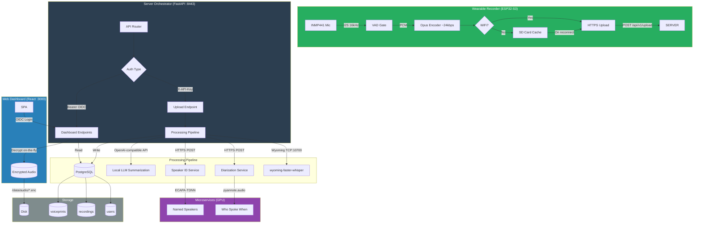
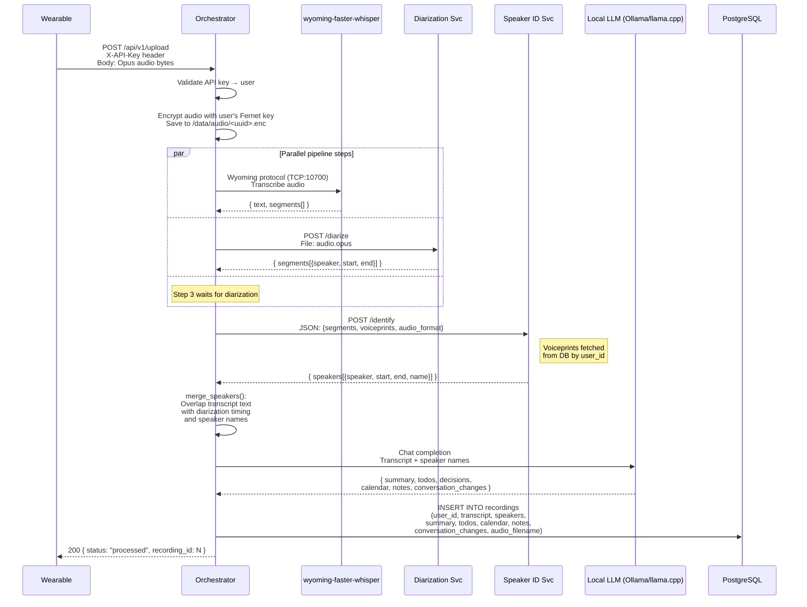
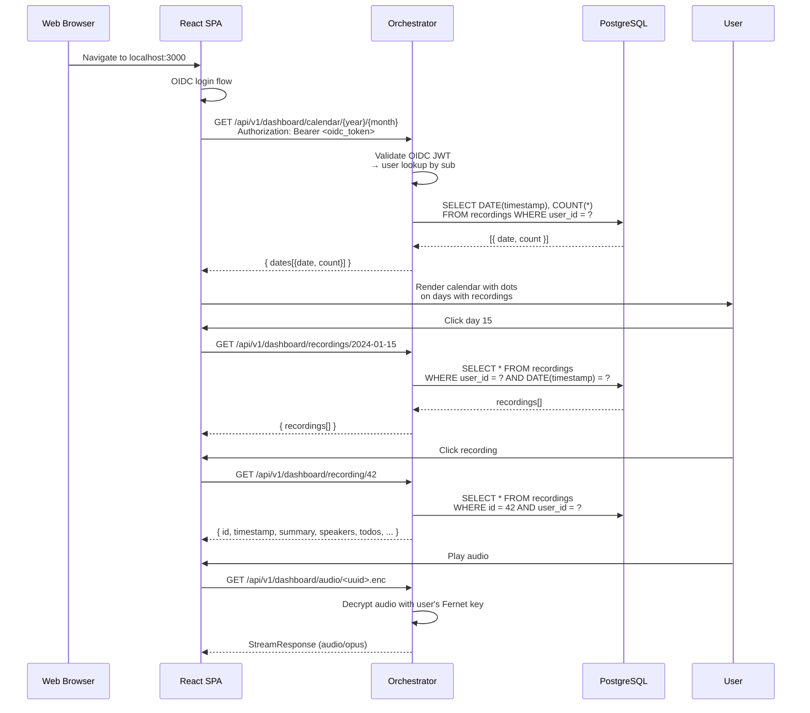
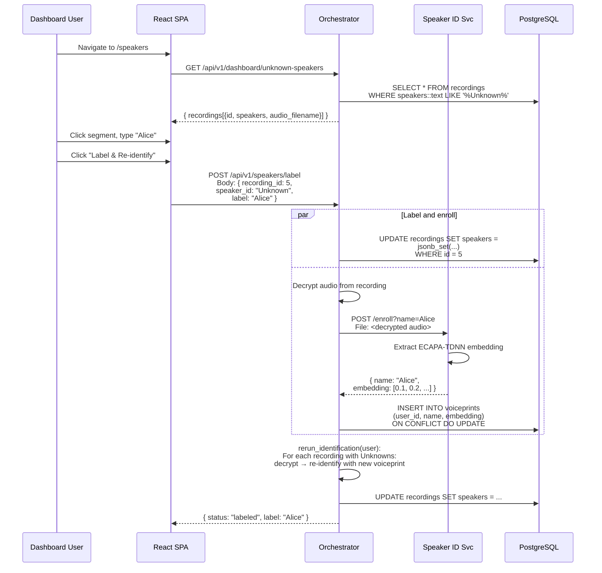
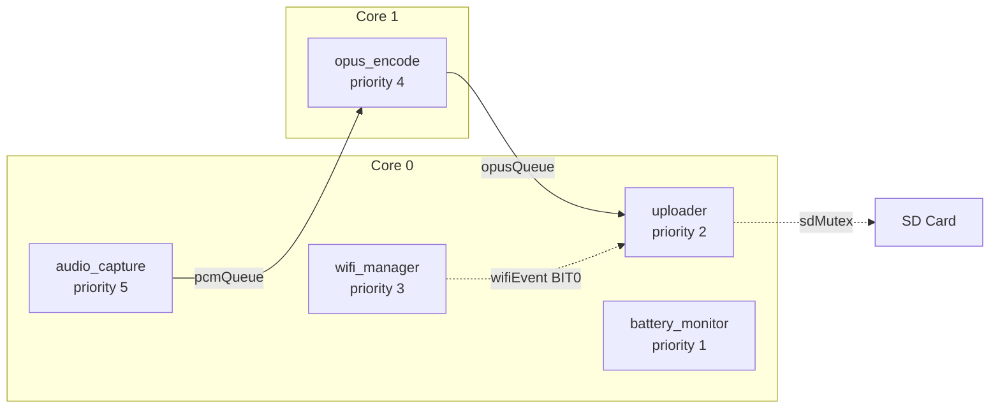
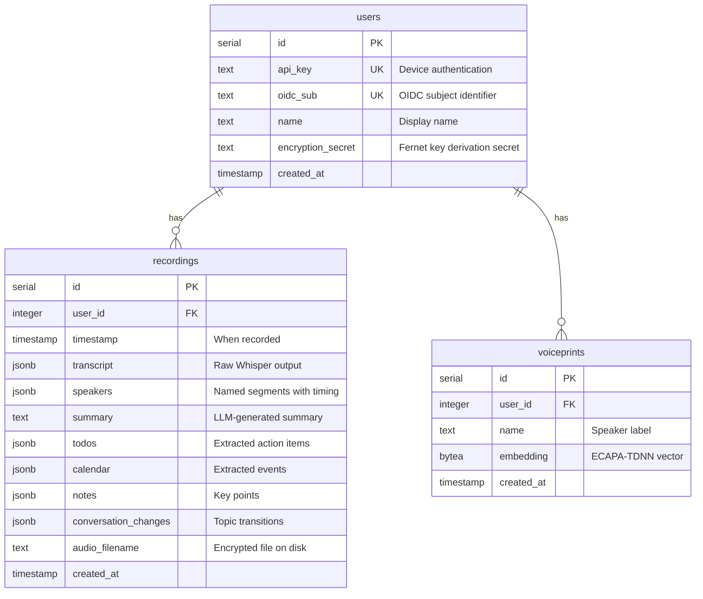
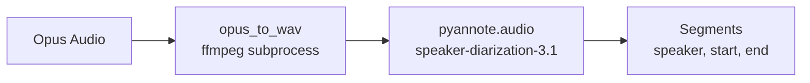
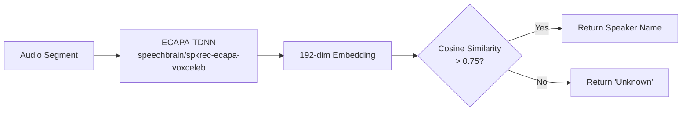
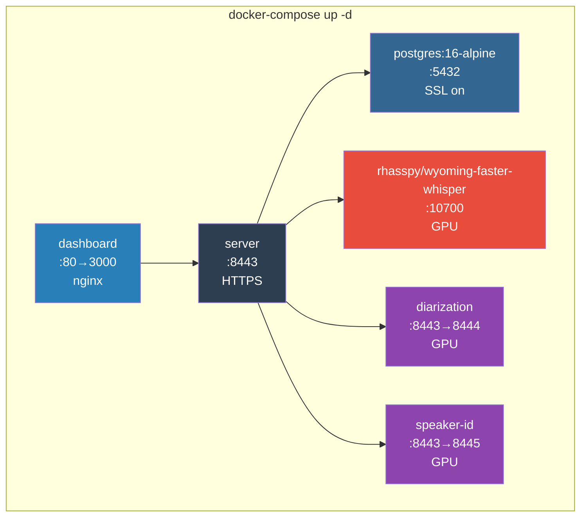
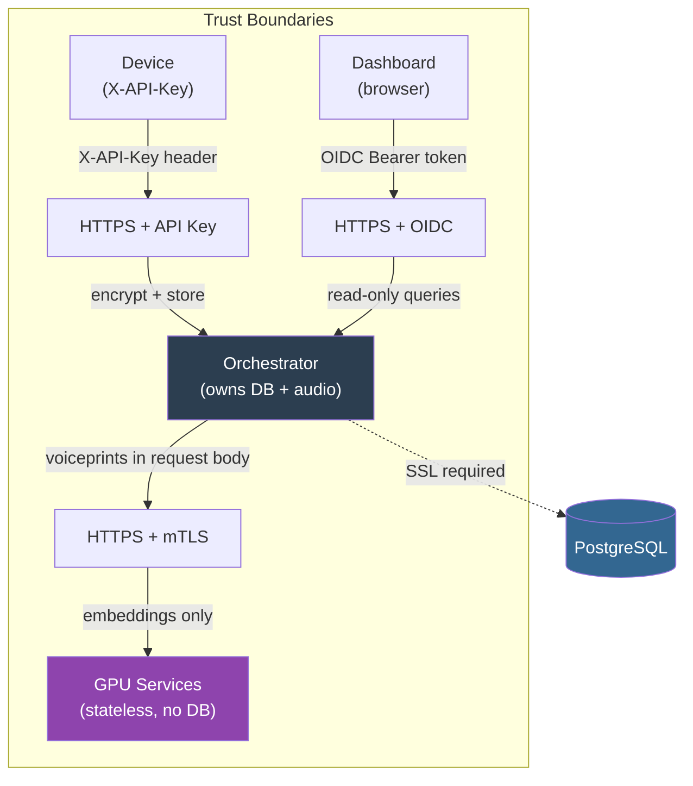

# LifeLog Architecture

## Table of Contents

- [Overview](#overview)
- [System Architecture](#system-architecture)
  - [Complete Ecosystem Diagram](#complete-ecosystem-diagram)
  - [Data Flow: Upload Pipeline](#data-flow-upload-pipeline)
  - [Data Flow: Dashboard Access](#data-flow-dashboard-access)
  - [Data Flow: Speaker Labeling](#data-flow-speaker-labeling)
- [Services](#services)
  - [Firmware (Wearable Recorder)](#firmware-wearable-recorder)
    - [Hardware](#hardware)
    - [FreeRTOS Task Architecture](#freertos-task-architecture)
    - [Audio Pipeline](#audio-pipeline)
    - [Power Management](#power-management)
  - [Server Orchestrator](#server-orchestrator)
    - [Authentication](#authentication)
    - [Audio Encryption](#audio-encryption)
    - [Database Schema](#database-schema)
    - [API Endpoints](#api-endpoints)
  - [Diarization Service](#diarization-service)
    - [API Endpoints](#diarization-api-endpoints)
  - [Speaker ID Service](#speaker-id-service)
    - [API Endpoints](#speaker-id-api-endpoints)
  - [Web Dashboard](#web-dashboard)
- [Infrastructure](#infrastructure)
  - [Docker Compose](#docker-compose)
  - [TLS Certificate Generation](#tls-certificate-generation)
  - [Environment Variables](#environment-variables)
- [Security Model](#security-model)

---

## Overview

LifeLog is a voice-activated life journal system composed of five components:

1. **Wearable Recorder** — XIAO ESP32-S3 Sense + INMP441 microphone captures audio, compresses it with Opus, and uploads when WiFi is available
2. **Server Orchestrator** — FastAPI service that coordinates transcription, diarization, speaker identification, and LLM summarization
3. **Diarization Service** — pyannote.audio microservice that determines "who spoke when"
4. **Speaker ID Service** — ECAPA-TDNN microservice that matches voice segments to known speakers
5. **Web Dashboard** — React SPA for browsing recordings, TODOs, decisions, and labeling unknown speakers

Audio is encrypted at rest with per-user Fernet keys. All inter-service communication uses HTTPS with mutual TLS. The orchestrator is the only service with database access.

---

## System Architecture

### Complete Ecosystem Diagram



### Data Flow: Upload Pipeline



### Data Flow: Dashboard Access



### Data Flow: Speaker Labeling



---

## Services

### Firmware (Wearable Recorder)

#### Hardware

| Component | Part | Connection |
|-----------|------|------------|
| MCU | XIAO ESP32-S3 Sense | — |
| Microphone | INMP441 | I2S (WS=42, SCK=41, SD=43) |
| SD Card | SPI mode | CS=2, MOSI=38, MISO=39, SCLK=40 |
| Battery | 400mAh LiPo | ADC pin 3 |
| LED | Built-in blue | GPIO 21 |

#### FreeRTOS Task Architecture



| Task | Core | Priority | Stack | Purpose |
|------|------|----------|-------|---------|
| `audio_capture` | 0 | 5 (highest) | 4 KB | Reads I2S mic, computes RMS for VAD, sends PCM chunks |
| `opus_encode` | 1 | 4 | 8 KB | Receives PCM, encodes to Opus at 24kbps, sends frames |
| `uploader` | 0 | 2 | 4 KB | HTTPS POST to server, saves to SD on failure |
| `battery_monitor` | 0 | 1 (lowest) | 2 KB | Reads ADC, blinks LED at low battery, deep sleep at critical |

#### Audio Pipeline

```
INMP441 → I2S (16kHz/16-bit mono) → VAD gate (RMS > 500)
  → PCM chunks (30ms / 480 samples) → Opus encoder (24kbps, 60ms frames)
  → HTTPS POST /api/v1/upload (X-API-Key header)
  → Fallback: SD card /lifelog/YYYYMMDD_HHMMSS_NNNN.opus
```

**VAD behavior**: Recording activates when RMS exceeds threshold. After 1.5 seconds of silence, an end-of-utterance marker flushes the Opus encoder buffer.

**WiFi reconnect**: Exponential backoff (1s → 30s max). On reconnect, the SD queue is flushed FIFO.

#### Power Management

| State | Voltage | Behavior |
|-------|---------|----------|
| Normal | > 3.3V | Full recording |
| Low | ≤ 3.3V | Blue LED blinks at 1Hz |
| Critical | ≤ 3.0V | Stop recording, flush pending uploads, deep sleep |

Battery percentage is estimated from a non-linear voltage mapping: 4.1V=100%, 3.8V=70%, 3.6V=50%, 3.4V=30%, 3.3V=10%, 3.0V=5%.

---

### Server Orchestrator

FastAPI application on port 8443 (HTTPS). The **only** service with direct database access.

#### Authentication

Two authentication mechanisms:

| Method | Used By | Header | Validation |
|--------|---------|--------|------------|
| API Key | Wearable devices | `X-API-Key: <key>` | Lookup in `users.api_key` |
| OIDC JWT | Web dashboard | `Authorization: Bearer <token>` | Verify RS256 signature, audience, issuer; lookup by `sub` claim |

**Critical design rule**: The `X-API-Key` and OIDC `sub` are **not** the same identity space. A user can have an API key for device uploads and a separate OIDC subject for dashboard access. Both map to the same `users` row.

#### Audio Encryption

Audio files are encrypted with per-user Fernet symmetric keys:

```
Key derivation: PBKDF2-SHA256(password=user.encryption_secret, salt="lifelog-{user_id}", iterations=100000)
Storage: /data/audio/{uuid}.enc
```

- Each user gets a unique `encryption_secret` (64-char hex) generated at account creation
- The same secret + user ID always produces the same key (deterministic)
- Decryption requires both the correct user ID and secret — wrong user or wrong secret fails
- Audio is decrypted **on-the-fly** when streaming to the dashboard; never stored unencrypted on disk

#### Database Schema



**Indexes**: `idx_recordings_user_timestamp` on `(user_id, timestamp)`, `idx_voiceprints_user` on `(user_id)`.

**Encryption at rest**: PostgreSQL runs with `ssl=on`. Connection pool uses `ssl='require'`. For production, add LUKS/dm-crypt on the host filesystem.

#### API Endpoints

All endpoints are prefixed with `/api/v1`.

##### `POST /api/v1/upload`

**Auth**: `X-API-Key` header (required)
**Content-Type**: `audio/opus` (binary body)

Accepts Opus audio from a wearable device and runs the full processing pipeline.

**Pipeline steps** (executed sequentially):

| Step | Service | Protocol | Description |
|------|---------|----------|-------------|
| 0 | Orchestrator | — | Validate API key → resolve user |
| 1 | Orchestrator | — | Encrypt and save audio to disk |
| 2 | wyoming-faster-whisper | TCP:10700 | Transcribe audio → `{text, segments[]}` |
| 3 | Diarization service | HTTPS | Who spoke when → `[{speaker, start, end}]` |
| 4 | Speaker ID service | HTTPS | Match segments to known speakers → `[{name, ...}]` |
| 5 | Orchestrator | — | `merge_speakers()`: overlap transcript text with diarization timing and speaker names |
| 6 | OpenAI-compatible API | HTTPS | Summarize → `{summary, todos, decisions, calendar, notes, conversation_changes}` |
| 7 | PostgreSQL | SSL | Store all results linked to user |

**Response**:
```json
{ "status": "processed", "recording_id": 42 }
```

**Non-obvious behavior**: Steps 2 and 3 run in parallel (transcription and diarization are independent). Step 4 waits for step 3 (needs diarization segments before identification). Step 5 merges outputs from steps 2, 3, and 4 using time-overlap matching — a transcript segment is assigned to a speaker if any part of its time range overlaps the speaker's segment.

---

##### `GET /api/v1/dashboard/calendar/{year}/{month}`

**Auth**: OIDC Bearer token (required)
**Path params**: `year` (int), `month` (int, 1-12)

Returns days in the given month that have recordings, with counts.

**Response**:
```json
{
  "dates": [
    { "date": "2024-01-15", "count": 3 },
    { "date": "2024-01-20", "count": 1 }
  ]
}
```

**Non-obvious behavior**: This endpoint executes raw SQL directly (not through the database module) because it needs `GROUP BY` aggregation that the other query functions don't support.

---

##### `GET /api/v1/dashboard/recordings/{date}`

**Auth**: OIDC Bearer token (required)
**Path params**: `date` (string, format `YYYY-MM-DD`)

Returns all recordings for the authenticated user on the given date.

**Response**:
```json
{
  "recordings": [
    {
      "id": 1,
      "timestamp": "2024-01-15T10:30:00",
      "summary": "Morning standup discussion",
      "speakers": [...],
      "todos": [...]
    }
  ]
}
```

---

##### `GET /api/v1/dashboard/recording/{recording_id}`

**Auth**: OIDC Bearer token (required)
**Path params**: `recording_id` (int)

Returns full recording details. Returns 404 if not found or not owned by the user.

**Response**: Full recording row including `transcript`, `speakers`, `summary`, `todos`, `calendar`, `notes`, `conversation_changes`, `audio_filename`.

**Non-obvious behavior**: The `speakers` field contains the **merged** output — each entry has `id`, `name`, `start`, `end`, and `text` (the transcript text attributed to that speaker segment). Unknown speakers have `name: "Unknown"`.

---

##### `GET /api/v1/dashboard/audio/{filename}`

**Auth**: OIDC Bearer token (required)
**Path params**: `filename` (string, the `.enc` filename)

Streams the decrypted audio file. The file is decrypted using the authenticated user's encryption secret — **not** just by filename. Requesting another user's audio file will fail with a decryption error.

**Response**: `StreamingResponse` with `Content-Type: audio/opus`

**Non-obvious behavior**: This is the only endpoint that streams binary data. The audio is decrypted entirely in memory before streaming — there is no temp file on disk.

---

##### `GET /api/v1/dashboard/todos`

**Auth**: OIDC Bearer token (required)

Aggregates all TODOs across all recordings for the user. Each todo includes `recording_id` and `recording_timestamp` for provenance.

**Response**:
```json
{
  "todos": [
    {
      "task": "Write proposal",
      "owner": "Alice",
      "due": "2024-01-20",
      "priority": "high",
      "recording_id": 5,
      "recording_timestamp": "2024-01-15T10:00:00"
    }
  ]
}
```

---

##### `GET /api/v1/dashboard/decisions`

**Auth**: OIDC Bearer token (required)
**Query params**: `limit` (int, optional, default: 20)

Returns recent recordings that contain decisions.

**Response**:
```json
{
  "decisions": [
    {
      "id": 1,
      "timestamp": "2024-01-15T10:00:00",
      "summary": "Decided to launch v2 on Friday"
    }
  ]
}
```

**Non-obvious behavior**: This endpoint returns **recording summaries** (not extracted decision objects). The dashboard displays the summary text which contains the decisions. The actual decision objects are inside each recording's `todos`/`speakers` JSONB.

---

##### `GET /api/v1/dashboard/unknown-speakers`

**Auth**: OIDC Bearer token (required)

Returns all recordings where the `speakers` JSONB contains `"Unknown"`. Used by the speaker labeling UI.

**Response**:
```json
{
  "recordings": [
    {
      "id": 5,
      "timestamp": "2024-01-15T10:00:00",
      "speakers": [{"name": "Unknown", "start": 0, "end": 2.5, "text": "..."}],
      "audio_filename": "abc123.enc"
    }
  ]
}
```

**Non-obvious behavior**: The query uses `speakers::text LIKE '%Unknown%'` — a text-level search on the JSONB column. This matches any segment with "Unknown" in any field, not just the `name` field. In practice this is fine because "Unknown" only appears as a speaker name.

---

##### `POST /api/v1/speakers/label`

**Auth**: OIDC Bearer token (required)
**Content-Type**: `application/json`

Labels an unknown speaker and triggers re-identification across all recordings.

**Request body**:
```json
{
  "recording_id": 5,
  "speaker_id": "Unknown",
  "label": "Alice"
}
```

| Field | Type | Required | Description |
|-------|------|----------|-------------|
| `recording_id` | int | yes | ID of the recording containing the unknown speaker |
| `speaker_id` | string | yes | The speaker identifier to replace (typically `"Unknown"`) |
| `label` | string | yes | The name to assign to this speaker |

**Response**:
```json
{ "status": "labeled", "label": "Alice" }
```

**Non-obvious behavior**: This endpoint does 4 things in sequence:

1. Updates the speaker name in the recording's `speakers` JSONB
2. Sends the recording's audio to the speaker-id service's `/enroll` endpoint to extract an ECAPA-TDNN embedding
3. Saves the embedding as a voiceprint in the database (upserts on `(user_id, name)` conflict)
4. Runs `rerun_identification()` which iterates **every** recording with unknown speakers, decrypts each audio file, re-runs speaker identification with the new voiceprint, and updates the recording

This means labeling one speaker can retroactively identify that speaker in all past recordings.

---

### Diarization Service

Standalone FastAPI microservice. Uses pyannote.audio for speaker diarization. No database access.

**GPU required**. Runs on CUDA by default.



#### Diarization API Endpoints

##### `POST /diarize`

**Content-Type**: `multipart/form-data`

Performs speaker diarization on uploaded audio.

**Request**: `file` — audio file (Opus format, converted to WAV internally via ffmpeg)

**Response**:
```json
{
  "segments": [
    { "speaker": "SPEAKER_00", "start": 0.0, "end": 2.5 },
    { "speaker": "SPEAKER_01", "start": 2.5, "end": 5.0 }
  ]
}
```

**Non-obvious behavior**: The service converts Opus to 16kHz mono WAV using ffmpeg before feeding to pyannote. Speaker labels are opaque IDs (`SPEAKER_00`, etc.) — they are not meaningful names. The orchestrator uses the `start`/`end` timestamps to correlate with transcript segments and speaker identification results.

---

##### `GET /health`

**Response**:
```json
{ "status": "healthy" }
```

---

### Speaker ID Service

Standalone FastAPI microservice. Uses SpeechBrain's ECAPA-TDNN for speaker embeddings. No database access.

**GPU required**. Runs on CUDA by default.



#### Speaker ID API Endpoints

##### `POST /identify`

**Content-Type**: `application/json`

Identifies speakers in diarized segments using provided voiceprints.

**Request body**:
```json
{
  "segments": [
    { "speaker": "SPEAKER_00", "start": 0.0, "end": 2.5 }
  ],
  "voiceprints": [
    { "name": "Alice", "embedding": [0.1, 0.2, ...] }
  ],
  "audio_format": "opus"
}
```

| Field | Type | Required | Description |
|-------|------|----------|-------------|
| `segments` | array | yes | Diarized segments with `speaker`, `start`, `end` |
| `voiceprints` | array | no | Known speaker embeddings (fetched by orchestrator from DB) |
| `audio_format` | string | no | Audio format hint (default: `"opus"`) |

**Response**:
```json
{
  "speakers": [
    { "speaker": "SPEAKER_00", "start": 0.0, "end": 2.5, "name": "Alice" },
    { "speaker": "SPEAKER_01", "start": 2.5, "end": 5.0, "name": "Unknown" }
  ]
}
```

**Non-obvious behavior**: Voiceprints are **passed in via the request**, not fetched from a database. The orchestrator queries its own database for the user's voiceprints and sends them to this service. This keeps the speaker-id service stateless and database-free. The `name` field defaults to `"Unknown"` when no voiceprint matches above the similarity threshold (0.75).

---

##### `POST /enroll`

**Query params**: `name` (string, required)
**Content-Type**: `multipart/form-data`

Extracts an ECAPA-TDNN embedding from an audio sample for enrollment.

**Request**: `file` — audio file (Opus, converted to WAV internally)

**Response**:
```json
{
  "name": "Alice",
  "embedding": [0.1, 0.2, 0.3, ...]
}
```

**Non-obvious behavior**: This endpoint returns the embedding to the **orchestrator** (not to the user). The orchestrator then saves it to the database via `save_voiceprint()`. The speaker-id service itself never persists data. The response embedding is a 192-dimensional float array.

---

##### Utility Functions (not endpoints)

| Function | Description |
|----------|-------------|
| `cosine_similarity(a, b)` | Computes cosine similarity between two numpy arrays |
| `match_voiceprint(embedding, voiceprints, threshold)` | Finds best matching voiceprint above threshold (default 0.75). Returns name or `"Unknown"` |
| `opus_to_wav(opus_bytes)` | Converts Opus to 16kHz mono WAV via ffmpeg subprocess. Cleans up temp files in `finally` block |

---

### Web Dashboard

React + TypeScript SPA served as static files. Built with Vite.

**Authentication**: OIDC login via `oidc-client-ts`. The SPA stores the access token and attaches it as `Authorization: Bearer <token>` to all API requests.

**Routes**:

| Path | Component | Description |
|------|-----------|-------------|
| `/` | `Calendar` | Monthly calendar with recording indicators; click day to see recordings |
| `/recording/:id` | `RecordingDetail` | Full recording view: summary, speakers, audio player, TODOs, decisions |
| `/todos` | `TodoList` | Aggregated TODOs across all recordings, with priority badges |
| `/decisions` | `DecisionsList` | Recent decisions from all recordings |
| `/speakers` | `SpeakerLabel` | Label unknown speakers; triggers re-identification |

**Audio playback**: The `AudioPlayer` component renders a timeline with colored segments per speaker. Clicking a segment seeks to that time. Unknown speakers are highlighted in red.

**No direct database access**: The dashboard talks only to the orchestrator's REST API.

---

## Infrastructure

### Docker Compose



| Service | External Port | Internal Port | GPU | Dependencies |
|---------|--------------|---------------|-----|--------------|
| postgres | 5432 | 5432 | No | — |
| server | 8443 | 8443 | No | postgres (healthy), wyoming-whisper, diarization, speaker-id |
| wyoming-whisper | 10700 | 10700 | Yes | — |
| diarization | 8444 | 8443 | Yes | — |
| speaker-id | 8445 | 8443 | Yes | — |
| dashboard | 3000 | 80 | No | server |

### TLS Certificate Generation

Run `./scripts/generate-certs.sh` to create:

1. A self-signed CA certificate (`ca.key`, `ca.crt`)
2. Per-service server certificates signed by the CA:
   - `server/certs/server.{key,crt}`
   - `diarization/certs/server.{key,crt}`
   - `speaker-id/certs/server.{key,crt}`

Each service mounts its certs as read-only. The server also mounts the CA cert to verify diarization and speaker-id service identities.

### Environment Variables

| Variable | Required | Used By | Description |
|----------|----------|---------|-------------|
| `POSTGRES_PASSWORD` | Yes | server, postgres | Database password |
| \`OPENAI_BASE_URL\` | Yes | server | Local LLM endpoint (Ollama, llama.cpp, etc.) |
| `HF_TOKEN` | Yes | diarization | HuggingFace token for pyannote models |
| `OIDC_ISSUER_URL` | Yes | server | OIDC provider issuer URL |
| `OIDC_CLIENT_ID` | Yes | server | OIDC client ID |
| `OIDC_CLIENT_SECRET` | Yes | server | OIDC client secret |
| `OIDC_REDIRECT_URI` | Yes | server | OIDC redirect URI |
| `WYOMING_HOST` | No (default: localhost) | server | Whisper host |
| `WYOMING_PORT` | No (default: 10700) | server | Whisper port |
| `DIARIZATION_URL` | No (default: https://localhost:8443) | server | Diarization service URL |
| `SPEAKER_ID_URL` | No (default: https://localhost:8443) | server | Speaker ID service URL |
| `AUDIO_STORAGE_PATH` | No (default: /data/audio) | server | Encrypted audio file storage |
| `POSTGRES_HOST` | No (default: localhost) | server | Database host |
| `POSTGRES_PORT` | No (default: 5432) | server | Database port |
| `POSTGRES_DB` | No (default: lifelog) | server | Database name |
| `POSTGRES_USER` | No (default: lifelog) | server | Database user |

---

## Security Model



**Key security properties**:

1. **Audio encryption at rest**: Every audio file is encrypted with a per-user Fernet key derived from PBKDF2. Even if disk is compromised, audio is unreadable without the user's secret.

2. **Database isolation**: Only the orchestrator connects to PostgreSQL. GPU services never see the database — voiceprints are passed in HTTP request bodies.

3. **HTTPS everywhere**: All inter-service communication uses TLS. Self-signed certs for development; Let's Encrypt for production.

4. **Per-user data isolation**: All database queries filter by `user_id`. The recording endpoint additionally checks ownership (`WHERE id = ? AND user_id = ?`).

5. **API key ≠ OIDC identity**: Device uploads (API key) and dashboard access (OIDC) are independent auth mechanisms that map to the same user record. A compromised API key cannot access the dashboard, and vice versa.

6. **GPU services are stateless**: The diarization and speaker-id services hold no persistent state. They receive audio + voiceprints, return results, and forget. Compromising them exposes neither the database nor stored audio.

---

## Roadmap

### OAuth Device Flow (planned)

Replace static API key authentication with [RFC 8628 OAuth Device Authorization Grant](https://datatracker.ietf.org/doc/html/rfc8628). Three key constraints:

1. **TTS code readout**: A dedicated TTS service generates an audio recording of the authorization code, which the device plays through its speaker. The user hears the code and authorizes it in their browser — no screen needed on the device.

2. **Flash storage for tokens**: Refresh tokens are stored in ESP32 flash memory (persists across restarts and power failures), **not** on the SD card. SD cards are removable and less secure; flash is soldered to the board.

3. **Minimal scope**: Tokens are granted the narrowest scope required for their role. A compromised token cannot access endpoints outside its scope.

#### Token Scopes

| Token | Scope | Access |
|-------|-------|--------|
| Device | `write:recordings` | POST to upload endpoint only |
| Dashboard (user) | `read:recordings`, `read:calendar`, `read:todos`, `read:decisions`, `write:speakers` | View recordings, calendar, TODOs, decisions; label unknown speakers |
| Dashboard (admin) | `manage:users` | Create/revoke users only. No access to any user data |

The admin token has **no** access to user data — it can only create and revoke user accounts. Recordings, transcripts, TODOs, and decisions are invisible to administrators. The device token has **no** read access — it cannot list recordings, view TODOs, enumerate other users' data, or access the dashboard in any way. The dashboard (user) token has **no** write access to recordings — it can only read and label speakers. Each role is a strict subset of what it needs, nothing more.

**Why this matters**: Static API keys baked into firmware are revocable but not rotatable without reflashing. OAuth tokens can be refreshed and revoked independently. The TTS readout eliminates the need for a display on the device, keeping the hardware minimal and power-efficient.

**Current state**: Not implemented. The static API key approach is sufficient for v1. See `firmware/src/config.h` for the current `API_KEY` configuration.
