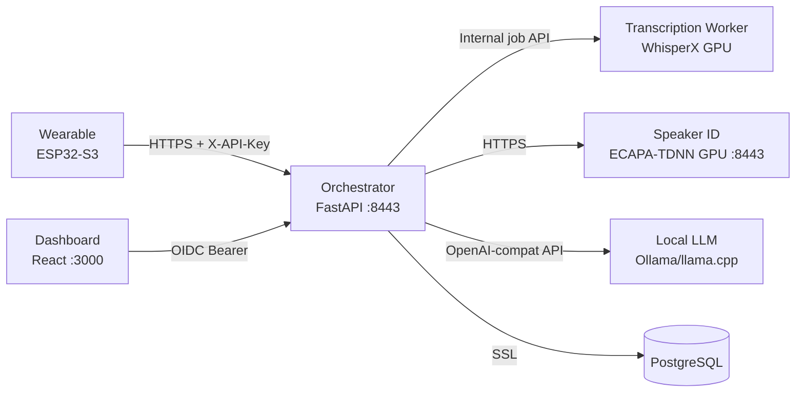

# LifeLog

> **Early Stage / Vibe Coded**
> This project has been heavily AI-assisted ("vibe coded") and is in very early stages of development. It has not been tested on real hardware, the API may change without notice, and there are likely bugs. Use at your own risk — but contributions and issues are welcome.

A **self-hosted, privacy-first** voice journal. Your recordings, transcriptions, and summaries never leave your own hardware. No cloud services, no third-party APIs, no telemetry — everything runs on machines you control.

Wear a small recorder, forget about it, and review your days through a web dashboard — complete with transcriptions, speaker identification, summaries, TODOs, and decisions extracted automatically. Your life data stays inside your own walls.

## Features

**Privacy & Security**
- **Fully self-hosted** — No data leaves your network. No cloud APIs, no external services required
- **Per-user encryption** — Audio files encrypted at rest with Fernet keys derived from user-specific secrets
- **HTTPS everywhere** — All inter-service communication encrypted with mutual TLS
- **Database isolation** — Only the orchestrator touches PostgreSQL; GPU services never see your data
- **OIDC authentication** — Dashboard login via your own identity provider (Keycloak, Auth0, Authelia)
- **Local LLM only** — Summarization runs on your own GPU via Ollama, llama.cpp, or any OpenAI-compatible endpoint

**Recording & Processing**
- **Wearable recording** — XIAO ESP32-S3 with built-in PDM mic, esp-sr AFE (noise suppression + VAD), Opus/OGG compression, SD card offline queue
- **Chunked upload** — Device streams audio in chunks; server tracks utterances and processes on completion
- **Background pipeline** — Worker polls for pending utterances and runs transcription, speaker identification, and summarization asynchronously
- **Session grouping** — Utterances grouped into sessions; quick ASR keeps active transcripts responsive and hourly reprocessing queues ten-minute full jobs
- **Asynchronous transcription + diarization** — A standalone GPU transcription-worker runs WhisperX; the server finalizes results and persists encrypted speaker audio
- **Speaker identification** — ECAPA-TDNN voiceprint matching with one-shot enrollment
- **LLM summarization** — Extracts summaries, TODOs, decisions, calendar events, and notes from conversations

**Dashboard & Review**
- **Interactive calendar** — Browse recordings by day, week, month; date persists in URL for back/forward navigation
- **Audio playback** — Play recordings with color-coded speaker segments, click to seek
- **Category filtering** — Filter recordings by work, personal, or other
- **Daily summaries** — LLM-generated Work/Personal breakdowns per day
- **Speaker labeling** — Label unknown speakers once, retroactively re-identifies across all past recordings
- **TODO & decision tracking** — Automatically extracted from conversations
- **Multi-service architecture** — Orchestrator + GPU services, scalable and distributable

## Privacy & Security

LifeLog is designed so that **your voice data never touches the outside internet**:

| Layer | Protection |
|-------|------------|
| **At rest** | Audio files encrypted with per-user Fernet keys (PBKDF2-derived). Even if someone accesses the disk, they cannot read your recordings |
| **In transit** | HTTPS with mutual TLS between all services. No plaintext on the wire |
| **Database** | PostgreSQL with SSL connections. Only the orchestrator has direct access — GPU services are stateless and hold no data |
| **LLM** | Runs locally on your hardware via Ollama/llama.cpp. No audio or transcripts are sent to OpenAI, Anthropic, or any cloud provider |
| **STT & Diarization** | WhisperX runs on your own GPU machines. No audio leaves your network |
| **Dashboard** | OIDC authentication against your own identity provider. No third-party analytics or tracking |
| **API keys** | Device authentication via API keys stored in your database. No external auth service required for device uploads |

The only external network call the system makes is to your own LLM endpoint — which you control.

## Architecture

See **[ARCHITECTURE.md](ARCHITECTURE.md)** for full architecture diagrams, endpoint documentation, database schema, security model, and data flow details.

High-level:



GPU services (transcription-worker, speaker-id) run on dedicated machines. The orchestrator, database, and dashboard run in Docker on the main server. **Nothing runs in the cloud.**

## Getting Started

### Prerequisites

- **Docker** with Docker Compose v2+
- **NVIDIA GPU** (for transcription-worker and speaker-id services)
- A machine running an **OpenAI-compatible LLM** (Ollama, llama.cpp, vLLM)
- An **OIDC provider** (Keycloak, Auth0, Authelia, etc.)
- **Node.js 20+** (only for dashboard dev without Docker)
- **PlatformIO** (only for firmware)

### 1. Clone and configure

```bash
git clone <repo-url> lifelog
cd lifelog

# Create your environment file
cp .env.example .env
```

Edit `.env` and fill in:

| Variable | What to set |
|----------|-------------|
| `POSTGRES_PASSWORD` | Any strong password |
| `OPENAI_BASE_URL` | Your LLM endpoint (e.g. `http://192.168.1.50:11434/v1`) |
| `OPENAI_MODEL` | Model name (e.g. `qwen2.5:7b`) |
| `HF_TOKEN` | Hugging Face token for the transcription-worker diarization model |
| `OIDC_ISSUER_URL` | Your OIDC provider URL |
| `OIDC_CLIENT_ID` | OIDC client ID |
| `OIDC_CLIENT_SECRET` | OIDC client secret |
| `OIDC_REDIRECT_URI` | Dashboard URL (e.g. `https://localhost:3000`) |

### 2. Generate TLS certificates

```bash
./scripts/generate-certs.sh
```

This creates self-signed certs for the server and speaker-id services.

### 3. Start the server stack

```bash
docker-compose up -d
```

Services started:
| Service | URL | Notes |
|---------|-----|-------|
| **Dashboard** | `http://localhost:3000` | React SPA |
| **Orchestrator** | `https://localhost:8444` | FastAPI, HTTPS |
| **Transcription worker** | `http://localhost:9001/health` | WhisperX transcription + diarization, GPU |
| **Speaker ID** | `https://localhost:8445` | ECAPA-TDNN, GPU |
| **PostgreSQL** | `localhost:5432` | SSL enabled |

### 4. Open the dashboard

Navigate to `http://localhost:3000` and log in via your OIDC provider.

### 5. Create a user

```bash
# Create a user with an API key for device uploads
curl -k -X POST "https://localhost:8444/api/v1/users" \
  -H "Content-Type: application/json" \
  -d '{"api_key": "my-device-key", "oidc_sub": "your-oidc-subject", "name": "Your Name"}'
```

Use this API key when flashing the firmware.

## Firmware

See **[firmware-ota/](firmware-ota/)** for the ESP32-S3 firmware source code and **[firmware-ota/ARCHITECTURE.md](firmware-ota/ARCHITECTURE.md)** for a deep-dive into the FreeRTOS task model, audio pipeline, and shared state.

### Hardware

| Component | Part | Notes |
|-----------|------|-------|
| Board | [XIAO ESP32-S3 Sense](https://www.seeedstudio.com/XIAO-ESP32S3-Microcontroller-v2-0-p-5853.html) | 8MB PSRAM, built-in PDM mic + SD slot |
| Microphone | Built-in PDM mic | GPIO 42 (CLK), GPIO 41 (DIN) |
| SD Card | SPI mode | CS=GPIO 21, MOSI=GPIO 38, MISO=GPIO 39, SCLK=GPIO 40 |
| Battery | 400mAh LiPo | ~11 hours with VAD |

### Build and flash

```bash
cd firmware-ota

# Build
pio run

# Flash via OTA (requires WiFi, and device already configured)
pio run -t upload

# Flash via USB (first flash, or when OTA unavailable)
# Full clean flash — bootloader + partitions + firmware + models:
esptool.py --chip esp32s3 --port /dev/ttyACM1 erase_flash
esptool.py --chip esp32s3 --port /dev/ttyACM1 --baud 921600 \
  write_flash \
    0x0 .pio/build/xiao_esp32s3/bootloader.bin \
    0x8000 .pio/build/xiao_esp32s3/partitions.bin \
    0x10000 .pio/build/xiao_esp32s3/firmware.bin

# Pack and flash esp-sr models (see firmware-ota/README.md#model-partition)
python3 -c "
import struct, os
MODEL_DIR = '.pio/libdeps/xiao_esp32s3/esp-sr/model'
STR_LEN = 32
def pack_string(s):
    b = s.encode('utf-8')[:STR_LEN]
    return b + b'\x00' * (STR_LEN - len(b))
needed = {
    'nsnet2': os.path.join(MODEL_DIR, 'nsnet_model/nsnet2'),
    'mn4q8_cn': os.path.join(MODEL_DIR, 'multinet_model/mn4q8_cn'),
}
models = {}
for name, path in needed.items():
    files = {}
    for f in sorted(os.listdir(path)):
        fp = os.path.join(path, f)
        if os.path.isfile(fp):
            with open(fp, 'rb') as fh:
                files[f] = fh.read()
    if files: models[name] = files
file_count = sum(len(v) for v in models.values())
header_size = 4 + len(models) * (STR_LEN + 4) + file_count * (STR_LEN + 4 + 4)
data_offsets = {}
current_offset = header_size
for name in sorted(models.keys()):
    for fname in sorted(models[name].keys()):
        data_offsets[(name, fname)] = current_offset
        current_offset += len(models[name][fname])
out = struct.pack('I', len(models))
for name in sorted(models.keys()):
    out += pack_string(name)
    out += struct.pack('I', len(models[name]))
    for fname in sorted(models[name].keys()):
        out += pack_string(fname)
        out += struct.pack('I', data_offsets[(name, fname)])
        out += struct.pack('I', len(models[name][fname]))
for name in sorted(models.keys()):
    for fname in sorted(models[name].keys()):
        out += models[name][fname]
with open(os.path.join(MODEL_DIR, 'srmodels.bin'), 'wb') as f:
    f.write(out)
print(f'Packed {len(out)/1024:.0f} KB ({len(out)} bytes)')
"
esptool.py --chip esp32s3 --port /dev/ttyACM1 --baud 921600 \
  write_flash 0x610000 .pio/libdeps/xiao_esp32s3/esp-sr/model/srmodels.bin

# Reset device — WiFi config portal appears on first boot
# Monitor serial output
pio device monitor
```

For firmware-only updates (models already on device), see [firmware-ota/README.md](firmware-ota/README.md).

### What the firmware does

1. Connects to WiFi (auto-reconnect with exponential backoff)
2. Reads audio from built-in PDM mic at 16kHz/16-bit
3. Processes through esp-sr AFE (noise suppression + voice activity detection)
4. Encodes to Opus/OGG at ~24kbps
5. Stores on SD card (offline queue)
6. Uploads chunks via HTTPS to the server with API key
7. Server processes utterances in background (transcription → speaker ID → summarization)

## Development

### Server (Python)

```bash
cd server
uv venv .venv
uv pip install -e ".[dev]"
.venv/bin/python -m pytest tests/ -v
```

### Dashboard (React)

```bash
cd dashboard
npm install
npm run dev      # http://localhost:5173 (proxies /api to server)
npm test          # Run vitest
```

### Running tests

```bash
# Python services
cd server && .venv/bin/python -m pytest tests/ -q        # 114 tests
cd diarization && .venv/bin/python -m pytest tests/ -q   # 8 tests
cd speaker-id && .venv/bin/python -m pytest tests/ -q    # 16 tests
cd transcription-worker && python -m pytest -q           # 10 tests

# Dashboard
cd dashboard && npx vitest run                            # 85 tests

# Firmware (native tests, no hardware required)
cd firmware-ota && pio test -e test                       # 69 tests
```

**Total: ~302 tests** across 6 components.

## Project Structure

```
lifelog/
├── firmware-ota/       ESP32-S3 FreeRTOS firmware (C++/Arduino)
├── server/             FastAPI orchestrator (Python)
├── transcription-worker/ Standalone WhisperX ASR + diarization worker (GPU)
├── speaker-id/         ECAPA-TDNN microservice (Python)
├── dashboard/          React SPA (TypeScript)
├── diarization/        Legacy pyannote.audio microservice (Python)
├── e2e/                End-to-end test suite
├── scripts/            TLS cert generation
├── docker-compose.yml  Service orchestration
├── ARCHITECTURE.md     Full architecture documentation
├── AGENTS.md           Repository guidelines for AI assistants
└── .gitignore
```

## License

TBD

## Roadmap

- [ ] **OAuth Device Flow** — Replace static API keys with RFC 8628 device authorization. TTS service reads the auth code aloud on the device speaker. Refresh tokens stored in ESP32 flash (not SD card). Token scopes: device gets write:recordings only; dashboard gets read:recordings, read:calendar, read:todos, read:decisions, write:speakers; admin gets manage:users only (no data access). See [ARCHITECTURE.md#roadmap](ARCHITECTURE.md#roadmap) for details. **Note**: TTS playback requires a speaker + I2S amplifier (MAX98357A), limiting this feature to custom board designs — the XIAO dev board has no audio output.
