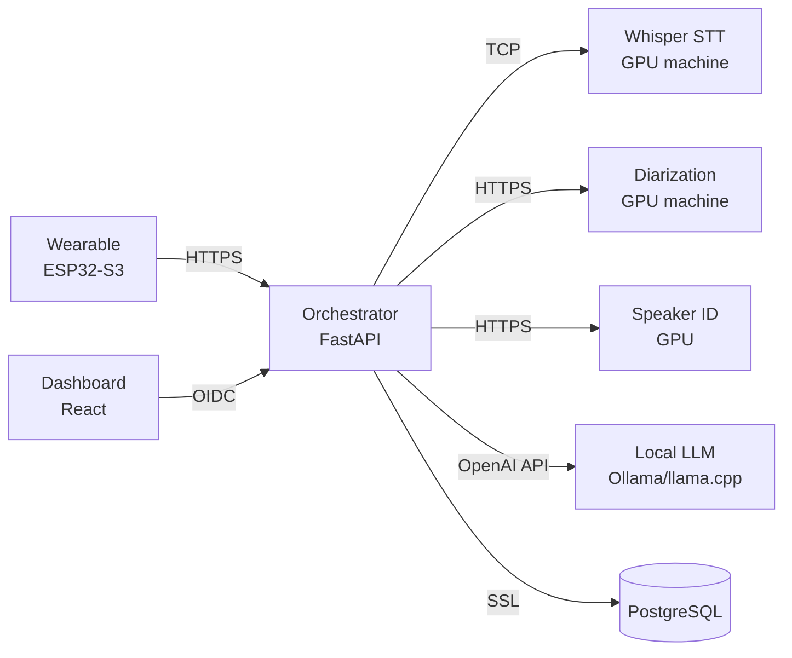

# LifeLog

> **⚠️ Early Stage / Vibe Coded**
> This project has been heavily AI-assisted ("vibe coded") and is in very early stages of development. It has not been tested on real hardware, the API may change without notice, and there are likely bugs. Use at your own risk — but contributions and issues are welcome.

A **self-hosted, privacy-first** voice journal. Your recordings, transcriptions, and summaries never leave your own hardware. No cloud services, no third-party APIs, no telemetry — everything runs on machines you control.

Wear a small recorder, forget about it, and review your days through a web dashboard — complete with transcriptions, speaker identification, summaries, TODOs, and decisions extracted automatically. Your life data stays inside your own walls.

## Features

**Privacy & Security**
- **Fully self-hosted** — No data leaves your network. No cloud APIs, no external services required
- **Per-user encryption** — Audio files encrypted at rest with Fernet keys derived from user-specific secrets
- **HTTPS everywhere** — All inter-service communication encrypted with mutual TLS
- **Database isolation** — Only the orchestrator touches PostgreSQL; GPU services never see your data
- **OIDC authentication** — Dashboard login via your own identity provider (Keycloak, Auth0, Authelia)
- **Local LLM only** — Summarization runs on your own GPU via Ollama, llama.cpp, or any OpenAI-compatible endpoint

**Recording & Processing**
- **Wearable recording** — XIAO ESP32-S3 with INMP441 mic, VAD-gated capture, Opus compression, SD card offline queue
- **Automatic transcription** — Whisper STT via Wyoming protocol (runs on your GPU)
- **Speaker diarization** — pyannote.audio determines who spoke when (runs on your GPU)
- **Speaker identification** — ECAPA-TDNN voiceprint matching with one-shot enrollment
- **LLM summarization** — Extracts summaries, TODOs, decisions, calendar events, and notes from conversations

**Dashboard & Review**
- **Interactive calendar** — Browse recordings by day, week, month
- **Audio playback** — Play recordings with color-coded speaker segments, click to seek
- **Speaker labeling** — Label unknown speakers once, retroactively re-identifies across all past recordings
- **TODO & decision tracking** — Automatically extracted from conversations
- **Multi-service architecture** — Orchestrator + GPU services, scalable and distributable

## Privacy & Security

LifeLog is designed so that **your voice data never touches the outside internet**:

| Layer | Protection |
|-------|------------|
| **At rest** | Audio files encrypted with per-user Fernet keys (PBKDF2-derived). Even if someone accesses the disk, they cannot read your recordings |
| **In transit** | HTTPS with mutual TLS between all services. No plaintext on the wire |
| **Database** | PostgreSQL with SSL connections. Only the orchestrator has direct access — GPU services are stateless and hold no data |
| **LLM** | Runs locally on your hardware via Ollama/llama.cpp. No audio or transcripts are sent to OpenAI, Anthropic, or any cloud provider |
| **STT & Diarization** | Whisper and pyannote run on your own GPU machines. No audio leaves your network |
| **Dashboard** | OIDC authentication against your own identity provider. No third-party analytics or tracking |
| **API keys** | Device authentication via API keys stored in your database. No external auth service required for device uploads |

The only external network call the system makes is to your own LLM endpoint — which you control.

## Architecture

See **[ARCHITECTURE.md](ARCHITECTURE.md)** for full architecture diagrams, endpoint documentation, database schema, security model, and data flow details.

High-level:



GPU services (Whisper, diarization) run on dedicated machines. The orchestrator, speaker-id, database, and dashboard run in Docker on the main server. **Nothing runs in the cloud.**

## Getting Started

### Prerequisites

- **Docker** with Docker Compose v2+
- **NVIDIA GPU** (for speaker-id service in the stack)
- A machine running **wyoming-faster-whisper** (STT)
- A machine running the **diarization service** (pyannote.audio)
- A machine running an **OpenAI-compatible LLM** (Ollama, llama.cpp, vLLM)
- An **OIDC provider** (Keycloak, Auth0, Authelia, etc.)
- **Node.js 20+** (only for dashboard dev without Docker)
- **PlatformIO** (only for firmware)

### 1. Clone and configure

```bash
git clone <repo-url> lifelog
cd lifelog

# Create your environment file
cp .env.example .env
```

Edit `.env` and fill in:

| Variable | What to set |
|----------|-------------|
| `POSTGRES_PASSWORD` | Any strong password |
| `OPENAI_BASE_URL` | Your LLM endpoint (e.g. `http://192.168.1.50:11434/v1`) |
| `OPENAI_MODEL` | Model name (e.g. `llama3`) |
| `WYOMING_HOST` | IP of your Whisper machine |
| `WYOMING_PORT` | Whisper port (default `10700`) |
| `DIARIZATION_URL` | URL of your diarization service (e.g. `https://192.168.1.50:8443`) |
| `OIDC_ISSUER_URL` | Your OIDC provider URL |
| `OIDC_CLIENT_ID` | OIDC client ID |
| `OIDC_CLIENT_SECRET` | OIDC client secret |
| `OIDC_REDIRECT_URI` | Dashboard URL (e.g. `https://localhost:3000`) |

### 2. Generate TLS certificates

```bash
./scripts/generate-certs.sh
```

This creates self-signed certs for the server, diarization, and speaker-id services.

### 3. Start the server stack

```bash
docker-compose up -d
```

Services started:
| Service | URL | Notes |
|---------|-----|-------|
| **Dashboard** | `http://localhost:3000` | React SPA |
| **Orchestrator** | `https://localhost:8443` | FastAPI, HTTPS |
| **Speaker ID** | `https://localhost:8445` | ECAPA-TDNN, GPU |
| **PostgreSQL** | `localhost:5432` | SSL enabled |

Wyoming Whisper and diarization run on their own machines (configured in `.env`).

### 4. Start GPU services (on your GPU machines)

**Whisper STT:**
```bash
docker run -d --gpus all --name whisper \
  -p 10700:10700 \
  rhasspy/wyoming-faster-whisper:latest \
  --model large-v3 --language en --dtype float16 --listen 0.0.0.0:10700
```

**Diarization:**
```bash
# On your GPU machine
cp -r diarization/ /path/to/gpu-machine/diarization/
cd /path/to/gpu-machine/diarization/
./scripts/generate-certs.sh  # (copy script from main repo)
# Create .env with HF_TOKEN (only needed for first run)
docker-compose up -d diarization
```

### 5. Open the dashboard

Navigate to `http://localhost:3000` and log in via your OIDC provider.

### 6. Create a user

```bash
# Create a user with an API key for device uploads
curl -k -X POST "https://localhost:8443/api/v1/users" \
  -H "Content-Type: application/json" \
  -d '{"api_key": "my-device-key", "oidc_sub": "your-oidc-subject", "name": "Your Name"}'
```

Use this API key when flashing the firmware.

## Firmware

### Hardware

| Component | Part | Notes |
|-----------|------|-------|
| Board | [XIAO ESP32-S3 Sense](https://www.seeedstudio.com/XIAO-ESP32S3-Microcontroller-v2-0-p-5853.html) | 8MB PSRAM, built-in cam |
| Microphone | [INMP441](https://www.adafruit.com/product/4694) | I2S digital mic |
| SD Card | Any SPI SD card | For offline audio caching |
| Battery | 400mAh LiPo | ~11 hours with VAD |

### Wiring

| INMP441 Pin | ESP32-S3 Pin |
|-------------|--------------|
| WS | GPIO 42 |
| SCK | GPIO 41 |
| SD | GPIO 43 |
| GND | GND |
| VDD | 3.3V |

| SD Card Pin | ESP32-S3 Pin |
|-------------|--------------|
| CS | GPIO 2 |
| MOSI | GPIO 38 |
| MISO | GPIO 39 |
| SCK | GPIO 40 |
| VCC | 3.3V |
| GND | GND |

### Build and flash

```bash
# Install PlatformIO if you haven't
pip install platformio

# Configure the firmware
# Edit firmware/src/config.h:
#   - Set WIFI_SSID and WIFI_PASSWORD
#   - Set SERVER_HOST and SERVER_PORT
#   - Set API_KEY (the one you created above)

cd firmware

# Build
pio run

# Flash via USB
pio run -t upload

# Monitor serial output
pio device monitor
```

### What the firmware does

1. Connects to WiFi (auto-reconnect with exponential backoff)
2. Reads audio from INMP441 mic at 16kHz/16-bit
3. Gates recording on voice activity (RMS threshold)
4. Encodes to Opus at ~24kbps
5. Uploads via HTTPS POST to the server with API key
6. If WiFi is unavailable, caches audio on SD card and flushes on reconnect
7. Blinks LED when battery is low, deep sleeps when critical

## Development

### Server (Python)

```bash
cd server
uv venv .venv
uv pip install -e ".[dev]"
.venv/bin/python -m pytest tests/ -v
```

### Dashboard (React)

```bash
cd dashboard
npm install
npm run dev      # http://localhost:5173 (proxies /api to server)
npm test          # Run vitest
```

### Running tests

```bash
# Python services
cd server && .venv/bin/python -m pytest tests/ -q        # 53 tests
cd diarization && .venv/bin/python -m pytest tests/ -q   # 8 tests
cd speaker-id && .venv/bin/python -m pytest tests/ -q    # 15 tests

# Dashboard
cd dashboard && npx vitest run                            # 58 tests
```

## Project Structure

```
lifelog/
├── firmware/          ESP32-S3 FreeRTOS firmware (C++)
├── server/            FastAPI orchestrator (Python)
├── diarization/       pyannote.audio microservice (Python)
├── speaker-id/        ECAPA-TDNN microservice (Python)
├── dashboard/         React SPA (TypeScript)
├── scripts/           TLS cert generation
├── docker-compose.yml Service orchestration
├── ARCHITECTURE.md    Full architecture documentation
├── AGENTS.md          Repository guidelines for AI assistants
├── .env.example       Environment variable template
└── .gitignore
```

## License

TBD

## Roadmap

- [ ] **OAuth Device Flow** — Replace static API keys with RFC 8628 device authorization. TTS service reads the auth code aloud on the device speaker. Refresh tokens stored in ESP32 flash (not SD card). Token scopes: device gets write:recordings only; dashboard gets read:recordings, read:calendar, read:todos, read:decisions, write:speakers; admin gets manage:users only (no data access). See [ARCHITECTURE.md#roadmap](ARCHITECTURE.md#roadmap) for details.
