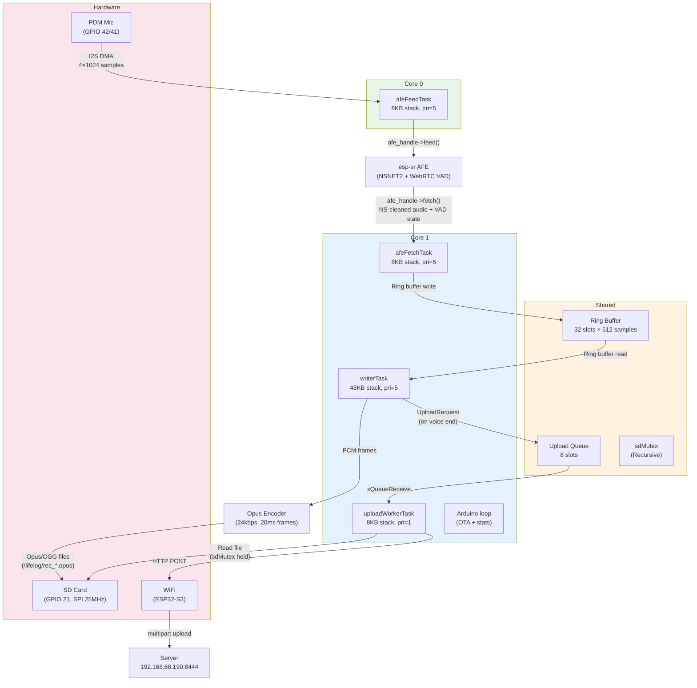
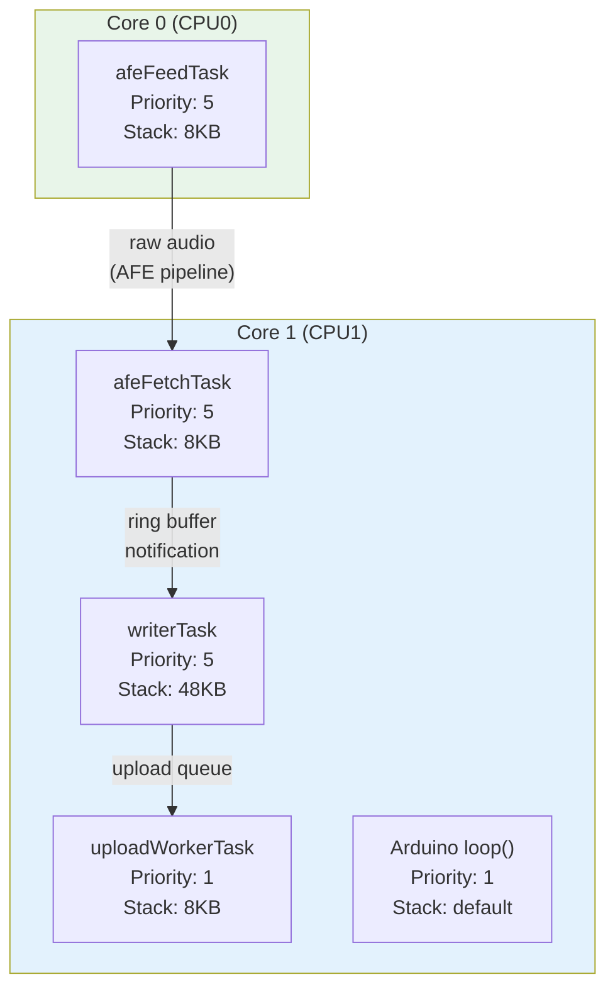
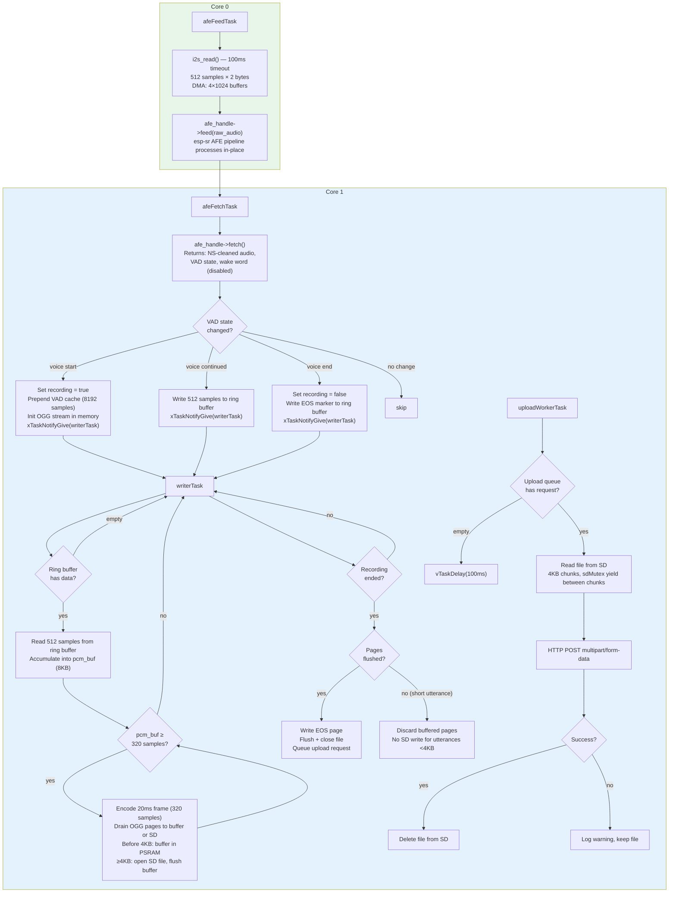
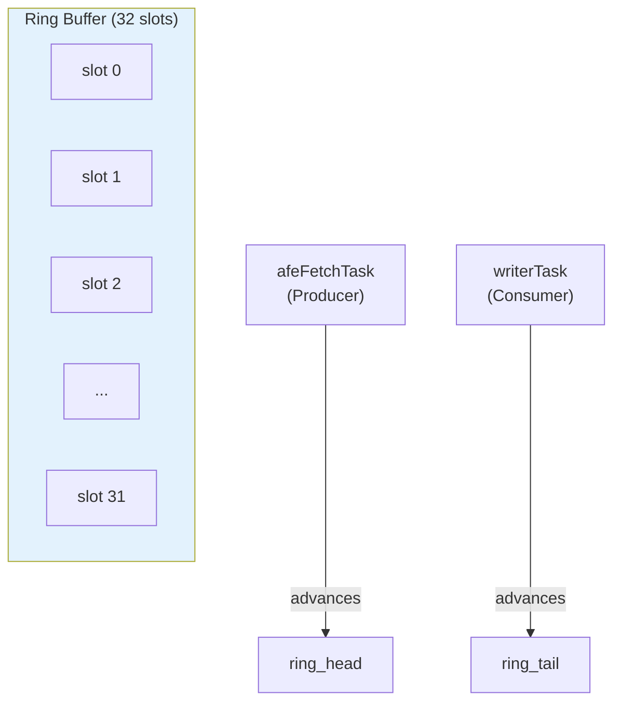
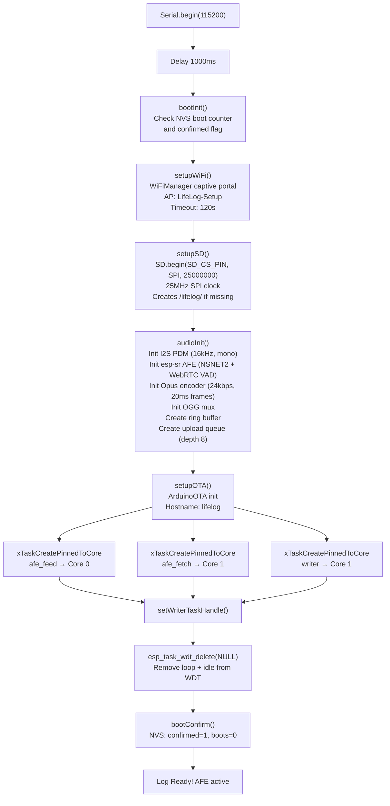
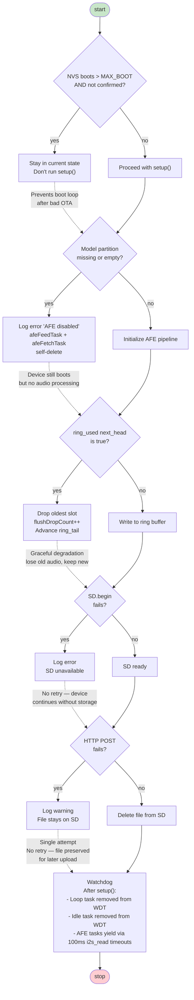

# Firmware-OTA Architecture

This document describes the architecture of the ESP32-S3 firmware for the LifeLog wearable audio recorder. It covers the FreeRTOS task model, core assignment, data flow, and shared state.

## System Overview

The firmware runs on a Seeed XIAO ESP32-S3 Sense (dual-core 240MHz, 8MB PSRAM, 8MB flash). Audio is captured from the built-in PDM microphone, processed through esp-sr for noise suppression and voice activity detection, encoded to Opus, stored on the SD card, and uploaded to the LifeLog server over WiFi.



> **Core 0** — isolated I2S reads. Keeps DMA off core 1 where SD and WiFi run.
> **Core 1** — all processing + I/O. Largest stack (48KB) for Opus encode + OGG mux.

## Core Assignment

The dual-core ESP32-S3 is split deliberately:

| Core | Tasks | Rationale |
|------|-------|-----------|
| **Core 0** | `afeFeedTask` only | Isolates I2S DMA reads from SD/WiFi contention. DMA and FSPI share internal bus resources — keeping DMA on a separate core prevents bus conflicts. |
| **Core 1** | `afeFetchTask`, `writerTask`, `uploadWorkerTask`, Arduino `loop()` | All audio processing, file I/O, and network operations run here. Tasks yield via timeouts, mutexes, and queue operations so the scheduler can interleave them. |



> **Why separate cores?** I2S DMA and FSPI (SD card) share internal bus resources on ESP32-S3. Running DMA on core 0 prevents bus contention with SD writes.
>
> **Why core 1 for everything else?** afeFetch needs fast access to ring buffer; writer needs Opus encode + SD write; uploader is low-priority background work; OTA runs in Arduino loop.

## Audio Pipeline

The audio pipeline transforms raw PDM microphone samples into Opus-encoded OGG files on the SD card. OGG pages are first buffered in PSRAM (≥4KB) before opening the SD file, eliminating SD latency during voice onset. Short utterances (<4KB) are discarded without touching SD.



## Shared State and Synchronization

All shared state between tasks is protected by mutexes or FreeRTOS primitives.

```mermaid
graph TB
    subgraph SharedState["Shared State"]
        sd_mutex["sdMutex<br/>(Recursive Mutex)"]
        ring_mutex["ring_mutex<br/>(Mutex)"]
        upload_q["uploadQueue<br/>(FreeRTOS Queue, depth 8)"]
        head["ring_head<br/>volatile uint32_t"]
        tail["ring_tail<br/>volatile uint32_t"]
        used["ring_used[32]<br/>volatile bool[]"]
        recording["recording<br/>volatile bool"]
        utt_id["utteranceId<br/>volatile uint32_t"]
        chunk_idx["chunkIndex<br/>volatile uint32_t"]
        is_final["isFinal<br/>volatile bool"]
        ogg_buf["ogg_buf<br/>PSRAM 16KB"]
        flushed["pages_flushed<br/>volatile bool"]
    end

    fetch["afeFetchTask"]
    writer["writerTask"]
    uploader["uploadWorkerTask"]

    fetch -->|"acquires to write ring buffer"| ring_mutex
    fetch -->|"writes VAD state"| recording
    fetch -->|"writes"| utt_id
    fetch -->|"writes"| chunk_idx
    fetch -->|"writes"| is_final

    writer -->|"acquires to read ring buffer"| ring_mutex
    writer -->|"reads VAD state"| recording
    writer -->|"acquires for SD writes"| sd_mutex
    writer -->|"xQueueSend"| upload_q

    uploader -->|"acquires for SD reads"| sd_mutex
    uploader -->|"xQueueReceive"| upload_q

    style SharedState fill:#fff3e0
```



> **sdMutex** is recursive — allows nested locking from upload stream chunks (4KB read → release → re-acquire).
>
> **ring_mutex** guards ring buffer head/tail/used[] between afeFetchTask (producer) and writerTask (consumer).

### Ring Buffer Detail

The ring buffer decouples the real-time audio capture from the variable-latency SD write and upload operations.

| Property | Value |
|----------|-------|
| Slots | 32 |
| Samples per slot | 512 |
| Bytes per slot | 1024 (512 × 2 bytes) |
| Total size | 32,768 bytes (32KB) |
| Duration | 1024ms at 16kHz |
| Producer | `afeFetchTask` (writes `ring_head`) |
| Consumer | `writerTask` (reads `ring_tail`) |
| Overflow | Oldest slot dropped, `flushDropCount++` |



> **Flow:**
> 1. afeFetchTask writes to ring_used[ring_head]
> 2. Advances ring_head = (ring_head + 1) % 32
> 3. Notifies writerTask via xTaskNotifyGive
> 4. writerTask reads from ring_used[ring_tail]
> 5. Advances ring_tail = (ring_tail + 1) % 32
>
> **Overflow:** If ring_used[next_head] is true (slot not consumed), oldest slot is dropped and ring_tail advances.

## Startup Sequence



## Opus/OGG Encoding

| Setting | Value |
|---------|-------|
| Codec | Opus (libopus via esp32_opus) |
| Container | OGG (libogg via codec-ogg) |
| Sample rate | 16 kHz (input) → 48 kHz (OGG granulepos) |
| Frame size | 20ms (320 samples at 16kHz) |
| Bitrate | 24 kbps |
| Complexity | 5 (0-10 scale) |
| Signal type | VOIP |
| Pre-skip | 3840 samples (80ms at 48kHz, per RFC 7845) |

**OGG Stream Structure:**
1. OpusHead packet (19 bytes) — stream metadata
2. OpusTags packet (28 bytes) — vendor "LifeLog ESP32"
3. Opus audio packets — encoded frames, pages flushed every ~4KB (~1.3s)
4. EOS (End of Stream) packet — 1-byte body

**Granulepos Calculation:** OGG granulepos is in 48kHz units. For 16kHz input:
```
granulepos += frame_size * 48000 / 16000  // = frame_size * 3
```

## Error Handling



## Configuration Reference

### Pin Assignments

| Pin | Function | Notes |
|-----|----------|-------|
| GPIO 21 | SD CS + LED | **Shared** — LED toggle disabled to avoid bus contention |
| GPIO 42 | I2S PDM CLK | Sense built-in mic |
| GPIO 41 | I2S PDM DIN | Sense built-in mic |

### Audio Pipeline Settings

| Setting | Value | Location |
|---------|-------|----------|
| Sample rate | 16,000 Hz | `audio.h` |
| DMA buffers | 4 × 1024 samples | `audio.cpp` |
| Ring buffer slots | 32 | `audio.cpp` |
| Ring buffer chunk | 512 samples (32ms) | `audio.cpp` |
| OGG buffer capacity | 16 KB (PSRAM) | `audio.cpp` |
| OGG flush threshold | 4 KB before SD open | `audio.cpp` |
| Opus frame | 20ms (320 samples) | `config.h` |
| Opus bitrate | 24 kbps | `config.h` |
| Opus complexity | 5 | `config.h` |
| SD SPI clock | 25 MHz | `main.cpp` |
| Upload chunk size | 4 KB | `upload.cpp` |
| Upload queue depth | 8 | `audio.cpp` |

### AFE Configuration

| Setting | Value |
|---------|-------|
| Type | `AFE_TYPE_VC` (voice command) |
| Mode | `AFE_MODE_LOW_COST` |
| Noise suppression | NSNET2 |
| VAD | WebRTC (fallback via NULL model name) |
| AGC | Enabled, 9dB compression, -3 dBFS target, 3.0× gain |
| WakeNet | Disabled (weak stubs) |
| Models | Loaded from `model` partition (mmap) |

### Server Connection

| Setting | Value |
|---------|-------|
| Host | `192.168.68.190` |
| Port | `8444` |
| Endpoint | `POST /api/v1/upload` |
| Auth | OAuth2 Bearer token (device code flow) |
| Protocol | HTTPS (cert bundle via `esp_crt_bundle_attach`) |

## Memory Layout

| Region | Address | Size | Content |
|--------|---------|------|---------|
| Bootloader | 0x0000 | ~12KB | ESP32-S3 bootloader |
| Partition table | 0x8000 | 4KB | Custom OTA partitions |
| NVS | 0x9000 | 20KB | WiFi config, boot counter |
| OTA data | 0xE000 | 8KB | Active app slot selector |
| app0 | 0x10000 | 3MB | Firmware (primary) |
| app1 | 0x310000 | 3MB | Firmware (OTA backup) |
| model | 0x610000 | 1.9MB | esp-sr models (nsnet2 + mn4q8_cn) |
| Free | 0x800000 | ~1.8MB | Available |

**Total flash used:** ~6.2MB of 8MB

## File Layout (SD Card)

```
/lifelog/
  rec_00000.opus
  rec_00001.opus
  rec_00002.opus
  ...
```

- Sequential zero-padded filenames
- Monotonically increasing `fileIndex` (RAM only — lost on reboot)
- Pre-opened: next file opened after voice ends to avoid ~150ms FAT32 create latency
- Deleted after successful upload

## Dependencies

| Library | Version | Purpose |
|---------|---------|---------|
| `tzapu/WiFiManager` | ^2.0.17 | Captive portal WiFi setup |
| `sh123/esp32_opus` | ^1.0.3 | Opus encoder |
| `pschatzmann/codec-ogg` | GitHub HEAD | OGG container mux |
| `espressif/esp-sr` | Commit `4f1b5607` | AFE (NSNET2 + VAD) |

Linked esp-sr precompiled libraries: `esp_audio_front_end`, `esp_audio_processor`, `dl_lib`, `vadnet`, `nsnet`, `c_speech_features`, `fst`, `hufzip`, `multinet`, `wakenet`

Weak stubs provided for: FFT symbols (`dl_rfft_*`), dotprod, WakeNet handle — these link against precompiled libs but never execute (AFE type VC + disabled wakenet).
