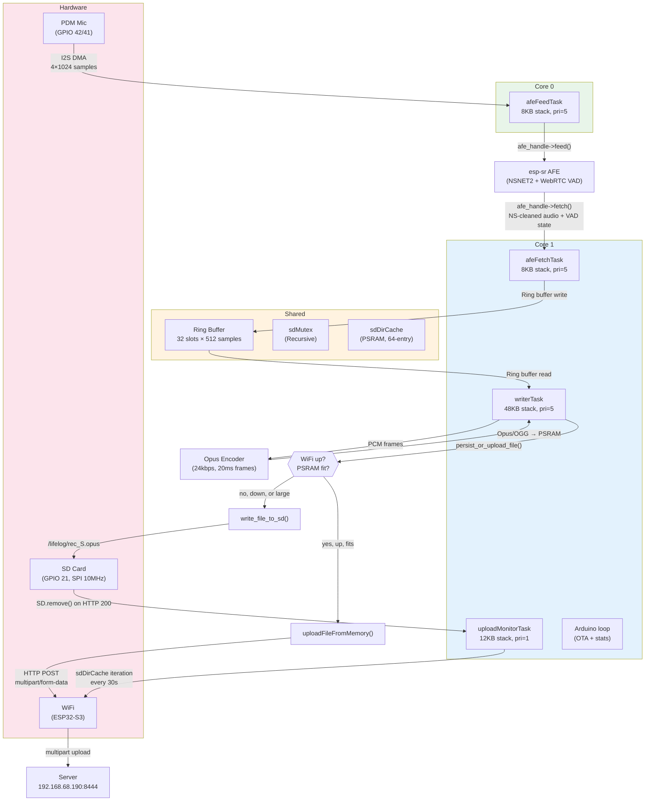
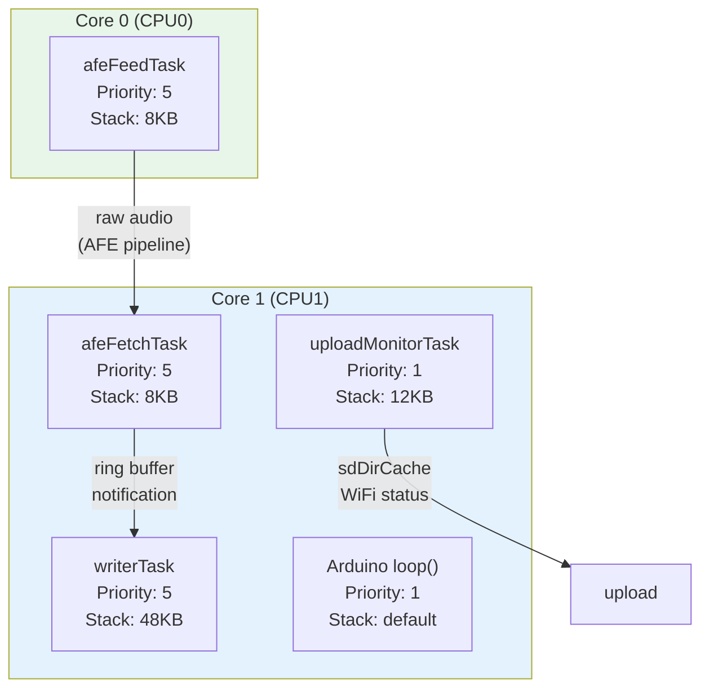
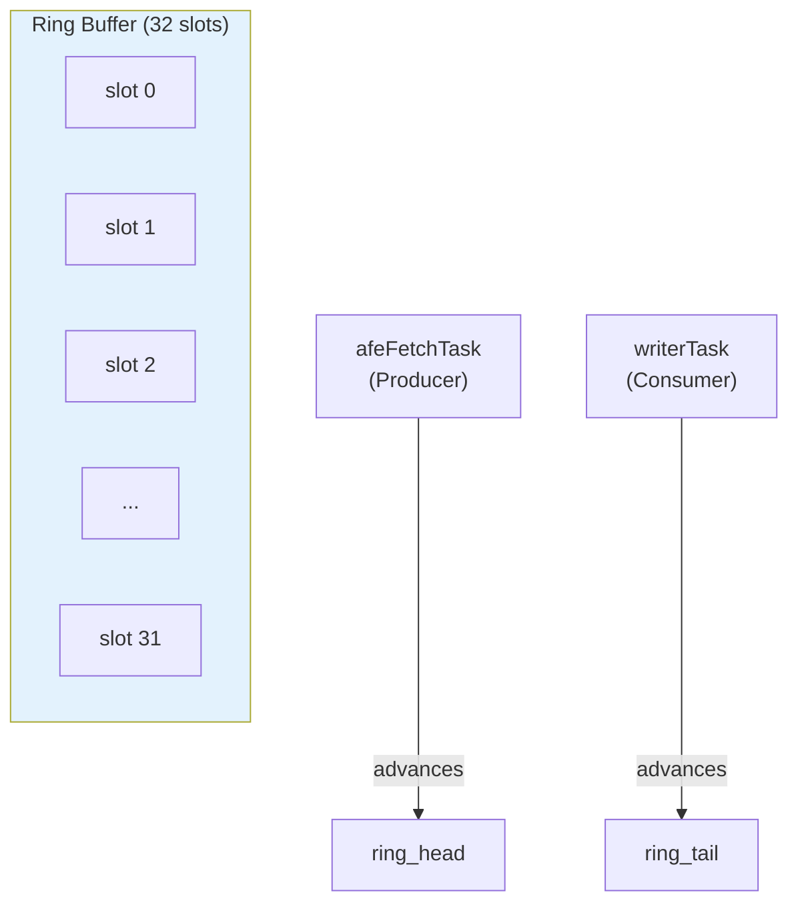
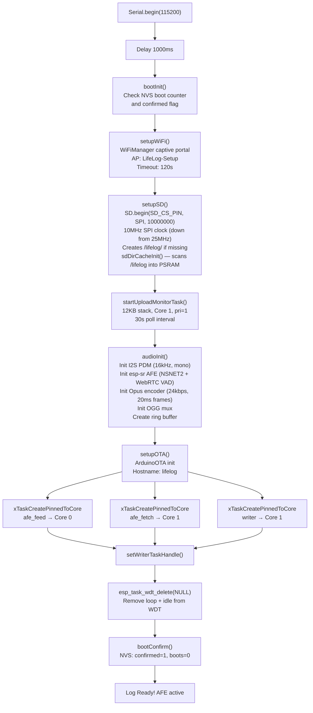
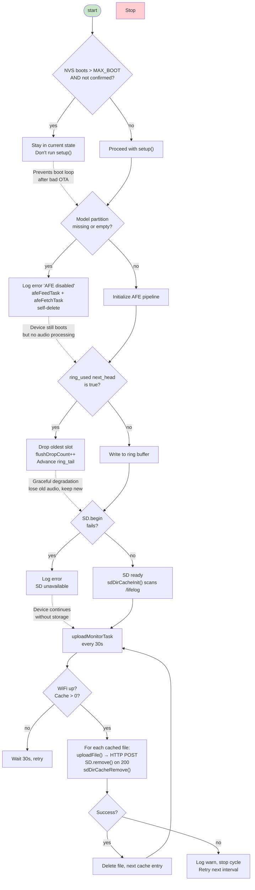

# Firmware-OTA Architecture

This document describes the architecture of the ESP32-S3 firmware for the LifeLog wearable audio recorder. It covers the FreeRTOS task model, core assignment, data flow, and shared state.

## System Overview

The firmware runs on a Seeed XIAO ESP32-S3 Sense (dual-core 240MHz, 8MB PSRAM, 8MB flash). Audio is captured from the built-in PDM microphone, processed through esp-sr for noise suppression and voice activity detection, encoded to Opus, and either uploaded directly over WiFi or stored on the SD card for later upload.



> **Core 0** — isolated I2S reads. Keeps DMA off core 1 where SD and WiFi run.
> **Core 1** — audio processing, SD I/O, and upload monitoring. `uploadMonitorTask` is low-priority (pri=1) and sleeps 30s between cycles.

## Core Assignment

The dual-core ESP32-S3 is split deliberately:

| Core | Tasks | Rationale |
|------|-------|-----------|
| **Core 0** | `afeFeedTask` only | Isolates I2S DMA reads from SD/WiFi contention. DMA and FSPI share internal bus resources — keeping DMA on a separate core prevents bus conflicts. |
| **Core 1** | `afeFetchTask`, `writerTask`, `uploadMonitorTask`, Arduino `loop()` | All audio processing, file I/O, and network operations run here. `uploadMonitorTask` is low-priority (pri=1) — it wakes every 30s, checks WiFi and the cache, and uploads any pending files before yielding. |



> **Why separate cores?** I2S DMA and FSPI (SD card) share internal bus resources on ESP32-S3. Running DMA on core 0 prevents bus contention with SD writes.
>
> **Why no uploadWorkerTask?** The prior architecture used a `uploadWorkerTask` consuming an `uploadQueue` (depth=8) for background uploads. This has been replaced by `uploadMonitorTask` which iterates the `sdDirCache` on a 30s interval. No queue is used — uploads are synchronous and blocking within the monitor task.

## Audio Pipeline

The audio pipeline transforms raw PDM microphone samples into Opus-encoded OGG files. Audio is accumulated in PSRAM and either uploaded directly from memory or written to the SD card when WiFi is unavailable. Long utterances that exceed the PSRAM buffer threshold are automatically flushed to SD as a new segment mid-utterance.

### Voice-end flush (per-utterance)

On voice end, `writerTask`:
1. Drains all remaining ring buffer items
2. Finalizes the OGG stream (`opus_file_end()`)
3. Calls `persist_or_upload_file()` — attempts memory upload, falls back to `write_file_to_sd()`

### Buffer-threshold flush (per-segment)

If `mem_buf_pos > SD_FLUSH_THRESHOLD` (1MB − 256KB) while still recording, the buffer is flushed to SD as a new segment file before encoding continues. This caps maximum PSRAM usage regardless of utterance length. The segment counter increments, the `chunkIndex` is advanced, and recording continues with a fresh PSRAM buffer.

### persist_or_upload_file()

```
if mem_buf_pos == 0: discard (short utterance)
if WiFi connected:
    attempt uploadFileFromMemory() — PSRAM direct upload
    if ok: delete SD file, return true
    if fail: write_file_to_sd()
else:
    write_file_to_sd()
return false
```

### write_file_to_sd()

Writes the current PSRAM buffer to `/lifelog/rec_<epoch>S<n>.opus`, then adds the file to `sdDirCache`. A flush (`f.flush()`) is called before `f.close()` to force the FAT cache to the SD card media — see [SD Durability](#sd-durability).

## Upload Monitor Task

`uploadMonitorTask` runs every 30 seconds on Core 1 (pri=1, 12KB stack). It:
1. Logs WiFi status and cached file count
2. If WiFi is up and cache is non-empty: iterates index 0 repeatedly (each `sdDirCacheRemove` shifts the array), uploads via `uploadFile()`, deletes the file from SD + cache on success
3. Breaks on first failure, waits for next 30s cycle

Files written by `write_file_to_sd()` are added to `sdDirCache` immediately. The cache is populated at startup via `sdDirCacheInit()` (full `/lifelog` scan, sorted alphanumerically) and updated on:
- **Add**: `write_file_to_sd()` after successful close
- **Remove**: `uploadMonitorTask` after successful HTTP upload, or `uploadFile()` PSRAM tier after successful memory upload

The monitor does NOT use the upload queue — uploads are synchronous and direct.

## SD Directory Cache

PSRAM-resident directory cache avoids repeated SD directory scans. The cache is a 64-entry inline struct (`~4.6KB PSRAM`) scanned once at startup.

| Function | Behavior |
|----------|----------|
| `sdDirCacheInit()` | Scans `/lifelog`, filters to `.opus`/`.wav`, sorts alphanumerically, logs count |
| `sdDirCacheGetEntry(i, &epoch)` | O(1) index lookup; returns `nullptr` if `i >= count` |
| `sdDirCacheGetCount()` | Returns current entry count |
| `sdDirCacheAdd(path, epoch)` | Appends to end (assumes timestamp-ordered insertion); returns false if `!valid` or full |
| `sdDirCacheRemove(path)` | Linear search + shift-down removal |
| `sdDirCacheInvalidate()` | Clears cache (forces rebuild on next init) |

## SD Durability

**Critical fix**: `VFSFileImpl::close()` in the ESP32 Arduino SD library calls `fclose()` but does **not** call `fsync()`. This means file data can remain in the kernel's FAT page cache and be lost on power loss.

`write_file_to_sd()` works around this by calling `f.flush()` before `f.close()`:
```cpp
f.flush();   // fflush() + fsync() — forces kernel page cache → SD card flash
f.close();
```

This is the workaround applied upstream in [espressif/arduino-esp32#1293](https://github.com/espressif/arduino-esp32/issues/1293) for `File::flush()`. Both `flush()` and `close()` return `void` on ESP32 Arduino, so errors are silently ignored by the library.

## Shared State and Synchronization

All shared state between tasks is protected by mutexes or FreeRTOS primitives.

```mermaid
graph TB
    subgraph SharedState["Shared State"]
        sd_mutex["sdMutex<br/>(Recursive Mutex)"]
        ring_mutex["ring_mutex<br/>(Mutex)"]
        cache["sdDirCache<br/>(PSRAM struct, 64-entry)"]
        head["ring_head<br/>volatile uint32_t"]
        tail["ring_tail<br/>volatile uint32_t"]
        used["ring_used[32]<br/>volatile bool[]"]
        recording["recording<br/>volatile bool"]
        utt_id["utteranceId<br/>volatile uint32_t"]
        chunk_idx["chunkIndex<br/>volatile uint32_t"]
        is_final["isFinal<br/>volatile bool"]
        ogg_buf["ogg_buf<br/>PSRAM 16KB"]
        flushed["pages_flushed<br/>volatile bool"]
    end

    fetch["afeFetchTask"]
    writer["writerTask"]
    mon["uploadMonitorTask"]

    fetch -->|"acquires to write ring buffer"| ring_mutex
    fetch -->|"writes VAD state"| recording
    fetch -->|"writes"| utt_id
    fetch -->|"writes"| chunk_idx
    fetch -->|"writes"| is_final

    writer -->|"acquires to read ring buffer"| ring_mutex
    writer -->|"reads VAD state"| recording
    writer -->|"acquires for SD writes"| sd_mutex

    mon -->|"acquires for SD reads"| sd_mutex
    mon -->|"reads"| cache

    style SharedState fill:#fff3e0
```



> **sdMutex** is recursive — allows nested locking from upload stream chunks (64KB read → release → re-acquire).
>
> **ring_mutex** guards ring buffer head/tail/used[] between afeFetchTask (producer) and writerTask (consumer).
>
> **uploadQueue is removed** — the prior `uploadWorkerTask` + FreeRTOS queue (depth=8) architecture is replaced by `uploadMonitorTask` which uses the `sdDirCache` and synchronous uploads.

### Ring Buffer Detail

The ring buffer decouples the real-time audio capture from the variable-latency SD write and upload operations.

| Property | Value |
|----------|-------|
| Slots | 32 |
| Samples per slot | 512 |
| Bytes per slot | 1024 (512 × 2 bytes) |
| Total size | 32,768 bytes (32KB) |
| Duration | 1024ms at 16kHz |
| Producer | `afeFetchTask` (writes `ring_head`) |
| Consumer | `writerTask` (reads `ring_tail`) |
| Overflow | Oldest slot dropped, `flushDropCount++` |



> **Flow:**
> 1. afeFetchTask writes to ring_used[ring_head]
> 2. Advances ring_head = (ring_head + 1) % 32
> 3. Notifies writerTask via xTaskNotifyGive
> 4. writerTask reads from ring_used[ring_tail]
> 5. Advances ring_tail = (ring_tail + 1) % 32
>
> **Overflow:** If ring_used[next_head] is true (slot not consumed), oldest slot is dropped and ring_tail advances.

## Startup Sequence



## Opus/OGG Encoding

| Setting | Value |
|---------|-------|
| Codec | Opus (libopus via esp32_opus) |
| Container | OGG (libogg via codec-ogg) |
| Sample rate | 16 kHz (input) → 48 kHz (OGG granulepos) |
| Frame size | 20ms (320 samples at 16kHz) |
| Bitrate | 24 kbps |
| Complexity | 5 (0-10 scale) |
| Signal type | VOIP |
| Pre-skip | 3840 samples (80ms at 48kHz, per RFC 7845) |
| PSRAM buffer | 1MB initial, grows by 128KB up to 1MB max |
| SD flush threshold | 768KB (1MB − 256KB headroom for EOS encode) |

**OGG Stream Structure:**
1. OpusHead packet (19 bytes) — stream metadata
2. OpusTags packet (28 bytes) — vendor "LifeLog ESP32"
3. Opus audio packets — encoded frames, accumulated in PSRAM
4. EOS (End of Stream) page — flushed on voice end or buffer threshold

**Segment files**: Long recordings are split into segments at the SD flush threshold. Each segment is a complete OGG stream (`rec_<epoch>S<n>.opus`). The server stitches segments into a single recording via `recorded_at` + `utterance_start_ms` timestamps.

**Granulepos Calculation:** OGG granulepos is in 48kHz units. For 16kHz input:
```
granulepos += frame_size * 48000 / 16000  // = frame_size * 3
```

## Error Handling



## Configuration Reference

### Pin Assignments

| Pin | Function | Notes |
|-----|----------|-------|
| GPIO 21 | SD CS | SPI chip select |
| GPIO 42 | I2S PDM CLK | Sense built-in mic |
| GPIO 41 | I2S PDM DIN | Sense built-in mic |

### Audio Pipeline Settings

| Setting | Value | Location |
|---------|-------|----------|
| Sample rate | 16,000 Hz | `audio.h` |
| DMA buffers | 4 × 1024 samples | `audio.cpp` |
| Ring buffer slots | 32 | `audio.cpp` |
| Ring buffer chunk | 512 samples (32ms) | `audio.cpp` |
| PSRAM buffer initial | 1 MB | `writer.cpp` |
| PSRAM buffer max | 1 MB | `writer.cpp` |
| PSRAM buffer growth | 128 KB increments | `writer.cpp` |
| SD flush threshold | 768 KB | `writer.cpp` |
| Opus frame | 20ms (320 samples) | `config.h` |
| Opus bitrate | 24 kbps | `config.h` |
| Opus complexity | 5 | `config.h` |
| SD SPI clock | 10 MHz | `main.cpp` |
| Upload chunk size | 4 KB | `upload.cpp` |
| sdDirCache max entries | 64 | `upload.cpp` |

### AFE Configuration

| Setting | Value |
|---------|-------|
| Type | `AFE_TYPE_VC` (voice command) |
| Mode | `AFE_MODE_LOW_COST` |
| Noise suppression | NSNET2 |
| VAD | WebRTC (fallback via NULL model name) |
| AGC | Disabled |
| WakeNet | Disabled (weak stubs) |
| Models | Loaded from `model` partition (mmap) |

### Upload Paths

| Tier | Condition | Mechanism |
|------|-----------|-----------|
| PSRAM direct | `fileSize <= PSRAM/2` | Entire file read into PSRAM, `uploadFileFromMemory()`, then `SD.remove()` |
| Streaming | Large files | 64KB chunk reads from SD with sdMutex per chunk, `esp_http_client` POST |

Both tiers call `esp_http_client_cleanup()` on failure and `SD.remove()` + `sdDirCacheRemove()` on HTTP 200.

### Server Connection

| Setting | Value |
|---------|-------|
| Host | `192.168.68.190` |
| Port | `8444` |
| Endpoint | `POST /api/v1/upload` |
| Auth | OAuth2 Bearer token (device code flow) |
| Protocol | HTTPS (cert bundle via `esp_crt_bundle_attach`) |

## Memory Layout

| Region | Address | Size | Content |
|--------|---------|------|---------|
| Bootloader | 0x0000 | ~12KB | ESP32-S3 bootloader |
| Partition table | 0x8000 | 4KB | Custom OTA partitions |
| NVS | 0x9000 | 20KB | WiFi config, boot counter |
| OTA data | 0xE000 | 8KB | Active app slot selector |
| app0 | 0x10000 | 3MB | Firmware (primary) |
| app1 | 0x310000 | 3MB | Firmware (OTA backup) |
| model | 0x610000 | 1.9MB | esp-sr models (nsnet2 + mn4q8_cn) |
| Free | 0x800000 | ~1.8MB | Available |

**Total flash used:** ~6.2MB of 8MB

## File Layout (SD Card)

```
/lifelog/
  rec_<epoch>S0.opus   ← segment 0 (first flush, or entire short recording)
  rec_<epoch>S1.opus   ← segment 1 (if buffer threshold hit mid-utterance)
  rec_<epoch>S2.opus   ← segment 2
  ...
```

- Segments are named `<epoch>S<n>` where `<epoch>` is the utterance start time and `<n>` is the zero-padded segment index.
- Segments are individual OGG streams (complete with OpusHead + OpusTags + audio + EOS).
- Deleted after successful upload by `uploadMonitorTask` or `uploadFile()` PSRAM tier.

## Dependencies

| Library | Version | Purpose |
|---------|---------|---------|
| `tzapu/WiFiManager` | ^2.0.17 | Captive portal WiFi setup |
| `sh123/esp32_opus` | ^1.0.3 | Opus encoder |
| `pschatzmann/codec-ogg` | GitHub HEAD | OGG container mux |
| `espressif/esp-sr` | Commit `4f1b5607` | AFE (NSNET2 + VAD) |

Linked esp-sr precompiled libraries: `esp_audio_front_end`, `esp_audio_processor`, `dl_lib`, `vadnet`, `nsnet`, `c_speech_features`, `fst`, `hufzip`, `multinet`, `wakenet`

Weak stubs provided for: FFT symbols (`dl_rfft_*`), dotprod, WakeNet handle — these link against precompiled libs but never execute (AFE type VC + disabled wakenet).
